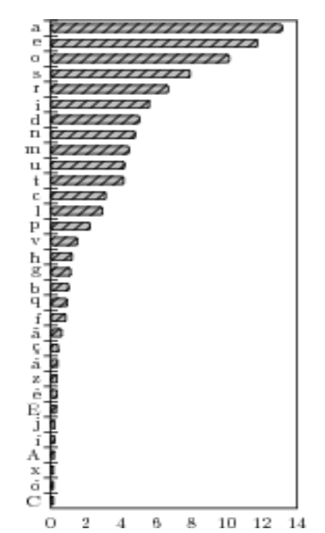
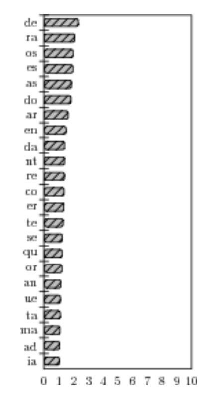
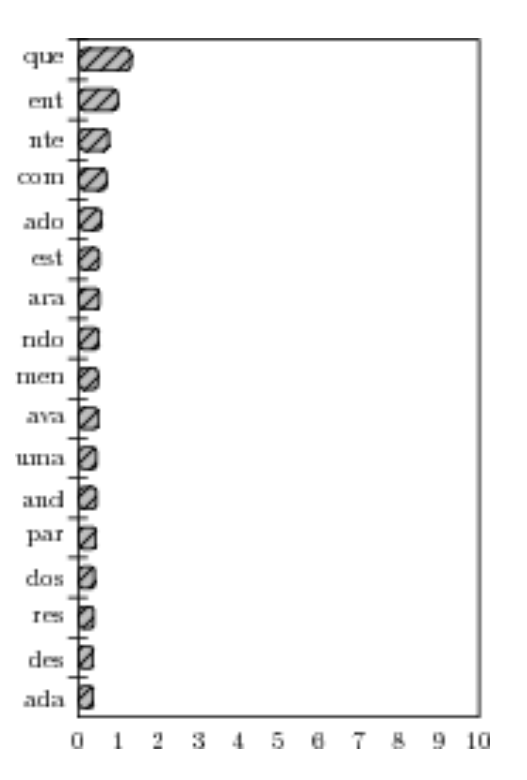

# CTF - Semana 10

**Objetivo**  
Decifrar um texto que nos é fornecido para encontrar a flag nele escondida, usando uma cifra de substituição de letras e análise de frequência.

## Procedimento
A metodologia deste desafio é muito semelhante ao que foi abordado no Logbook 9 sobre cifras de substituição. Como no guião, iremos utilizar um script em Python que analisa a frequência de letras, digramas e trigramas. Vamos adaptar o script para que imprima o texto decifrado durante o processo, função semelhante ao comando *tr* usado no guião.

O texto a decifrar é o seguinte:
```
,?>?^>*;[@:|;*>%~*>.>=:)>;<%<::|@%|?*%<:@><;<;%,:[~:|+;<%,/^:(%*;[@%|?*>-^?%,<:@>,>.%,~;*;;[^<;|@;(>|;=[:|?:%~:*;<;<:>|/^>=>|%;~*%~*>:?;*>%%@;[>|+%@%,?^[;,:*=%|)%%>)+;~:%*);|>,[%:,?;?;=/^:):*:%~;*/^:+;->?;@>%|;=<%:,?;<%;,@;,;,<:?%<%,|%,;@*:<>?;/^:|;%:;,,>[|:@:,,;*>;[:|?::~;*;:,?:;|%?:[~*%)*;[;<;;.:|<;;%,,:^,>|/^>=>|%,<;,@;,;,/^:+;->?;[|>|)^:[:%-*>);<%;@%[~*;*[;,,:)^|<%%,*:,~%|,;.:>,;,.:|<;,:,?;%;,:*^[,^@:,,%/^:?>~%<:,^@:,,%~%<:,:*:,?:,:%,>|/^>=>|%,<%>)+;~:,;%|;,^;[;>%*>;~:,,%;,<:~%^@%,*:@^*,%,[^{=^@.[?.>:(>=,^)%}
```

O texto está escrito em português e não contém espaços.

A flag estará no final do texto, já que está delimitada pelos parêntesis ```{ }```.

O script que construímos é o seguinte:
``` py
from collections import Counter

def decode_text(encoded_text, cipher):
    decoded_text = ''.join(cipher.get(char, char) for char in encoded_text)
    return decoded_text

def frequencies(text, n):
    ngrams = [text[i:i+n] for i in range(len(text) - n + 1)]
    return Counter(ngrams)

encoded_text = ",?>?^>*;[@:|;*>%~*>.>=:)>;<%<::|@%|?*%<:@><;<;%,:[~:|+;<%,/^:(%*;[@%|?*>-^?%,<:@>,>.%,~;*;;[^<;|@;(>|;=[:|?:%~:*;<;<:>|/^>=>|%;~*%~*>:?;*>%%@;[>|+%@%,?^[;,:*=%|)%%>)+;~:%*);|>,[%:,?;?;=/^:):*:%~;*/^:+;->?;@>%|;=<%:,?;<%;,@;,;,<:?%<%,|%,;@*:<>?;/^:|;%:;,,>[|:@:,,;*>;[:|?::~;*;:,?:;|%?:[~*%)*;[;<;;.:|<;;%,,:^,>|/^>=>|%,<;,@;,;,/^:+;->?;[|>|)^:[:%-*>);<%;@%[~*;*[;,,:)^|<%%,*:,~%|,;.:>,;,.:|<;,:,?;%;,:*^[,^@:,,%/^:?>~%<:,^@:,,%~%<:,:*:,?:,:%,>|/^>=>|%,<%>)+;~:,;%|;,^;[;>%*>;~:,,%;,<:~%^@%,*:@^*,%,[^{=^@.[?.>:(>=,^)%}"
encoded_letters = "" # Letras cifradas
real_letters = "" # Letras que achamos que correspondem às cifradas
cipher = {encoded_letters[i]: real_letters[i] for i in range(len(encoded_letters))}
decoded_text = decode_text(encoded_text, cipher)
print(f"Text: {decoded_text}")

print("\nFrequências:")
for n in range(1, 4):
    stats = frequencies(encoded_text, n)
    print(f"{n}-grams: {stats.most_common(15)}")
```

## Análise de Frequência e Decifração de Letras
Iremos usar como apoio um estudo, realizado por Pedro Quaresma e Augusto Pinho, sobre a frequência de letras na língua portuguesa. O link para o pdf do estudo encontra-se [aqui](https://www.mat.uc.pt/~pedro/lectivos/CodigosCriptografia1011/interTIC07pqap.pdf). Abaixo encontram-se gráficos da análise de frequências, retirados do estudo referido:

  

*Figura 1 - letras mais comuns*  

  

*Figura 1 - digramas mais comuns* 

  

*Figura 1 - trigramas mais comuns*  

Após a execução do script, obtivemos as seguintes estatísticas:
```
1-grams       2-grams       3-grams
';', 67       '%,', 14      '/^:', 6
':', 59       ';,', 14      ':,?', 5
',', 58       ':,', 14      ';<%', 4
'%', 55       '/^', 9       '%<:', 4
'>', 40       '>|', 9       ':,,', 4
'|', 30       ';[', 8       '*;[', 3
'*', 29       ':|', 8       ';*>', 3
'^', 25       '*>', 8       ';<;', 3
'<', 25       ';<', 8       '%,<', 3
'?', 22       '<%', 8       ',<:', 3
'[', 20       '<:', 8       '~;*', 3
'@', 19       '<;', 8       '>|/', 3
'~', 17       ',:', 8       '|/^', 3
')', 11       '?;', 8       '/^>', 3
'=', 10       ',?', 7       '^>=', 3
```

Olhando principalmente para as letras e para os trigramas, podemos deduzir que:
- ';' corresponde a 'a'
- ':' corresponde a 'e' ou 'o'. Como '/^:' é o mais frequente, corresponde a 'que' e, portanto, ':' corresponde a 'e'
- ',' corresponde a 'o' ou 's'. Como vários digramas acabam em ',', é mais provável que corresponda a 's'
- ':,?' corresponde a 'est', tendo em conta as deduções anteriores
- '%' corresponde a 'o', por exclusão de partes das deduções anteriores

Vamos substituir as letras consideradas no texto:

```
st>tu>*a[@e|a*>o~*>.>=e)>a<o<ee|@o|t*o<e@><a<aose[~e|+a<osque(o*a[@o|t*>-utos<e@>s>.os~a*aa[u<a|@a(>|a=[e|teo~e*a<a<e>|qu>=>|oa~*o~*>eta*>oo@a[>|+o@ostu[ase*=o|)oo>)+a~eo*)a|>s[oestata=que)e*eo~a*que+a->ta@>o|a=<oesta<oas@asas<eto<os|osa@*e<>taque|aoeass>[|e@essa*>a[e|tee~a*aestea|ote[~*o)*a[a<aa.e|<aaosseus>|qu>=>|os<as@asasque+a->ta[|>|)ue[eo-*>)a<oa@o[~*a*[asse)u|<oos*es~o|sa.e>sas.e|<asestaoase*u[su@essoquet>~o<esu@esso~o<ese*esteseos>|qu>=>|os<o>)+a~esao|asua[a>o*>a~essoas<e~ou@os*e@u*sos[u{=u@.[t.>e(>=su)o}
```

Após a análise inicial, o objetivo passa por tentar formar palavras que façam sentido. Temos expressões como ```su@esso``` e ```~essoas```, pelo que podemos considerar '@' e '~' como 'c' e 'p', respetivamente, para formar as palavras "sucesso" e "pessoas".

Vamos analisar novamente o texto parcialmente decifrado:
```
st>tu>*a[ce|a*>op*>.>=e)>a<o<ee|co|t*o<ec><a<aose[pe|+a<osque(o*a[co|t*>-utos<ec>s>.ospa*aa[u<a|ca(>|a=[e|teope*a<a<e>|qu>=>|oap*op*>eta*>ooca[>|+ocostu[ase*=o|)oo>)+apeo*)a|>s[oestata=que)e*eopa*que+a->tac>o|a=<oesta<oascasas<eto<os|osac*e<>taque|aoeass>[|ecessa*>a[e|teepa*aestea|ote[p*o)*a[a<aa.e|<aaosseus>|qu>=>|os<ascasasque+a->ta[|>|)ue[eo-*>)a<oaco[p*a*[asse)u|<oos*espo|sa.e>sas.e|<asestaoase*u[sucessoquet>po<esucessopo<ese*esteseos>|qu>=>|os<o>)+apesao|asua[a>o*>apessoas<epoucos*ecu*sos[u{=uc.[t.>e(>=su)o}
```

Olhando, por exemplo, para a expressão ```pessoas<epoucos*ecu*sos```, podemos considerar que é, na verdade, "pessoas de poucos recursos". Logo, '<' e '*' serão 'd' e 'r', respetivamente. De realçar que estas substituições intermédias continuam a seguir aproximadamente a análise de frequências.

Vai-se tornando cada vez mais fácil formar palavras e expressões que façam sentido:
```
st>tu>ra[ce|ar>opr>.>=e)>adodee|co|trodec>dadaose[pe|+adosque(ora[co|tr>-utosdec>s>.osparaa[uda|ca(>|a=[e|teoperadade>|qu>=>|oapropr>etar>ooca[>|+ocostu[aser=o|)oo>)+apeor)a|>s[oestata=que)ereoparque+a->tac>o|a=doestadoascasasdetodos|osacred>taque|aoeass>[|ecessar>a[e|teeparaestea|ote[pro)ra[adaa.e|daaosseus>|qu>=>|osdascasasque+a->ta[|>|)ue[eo-r>)adoaco[prar[asse)u|doosrespo|sa.e>sas.e|dasestaoaseru[sucessoquet>podesucessopodeseresteseos>|qu>=>|osdo>)+apesao|asua[a>or>apessoasdepoucosrecursos[u{=uc.[t.>e(>=su)o}
```

Novamente, existem expressões como ```acred>taque|aoeass>[|ecessar>a[e|te```, que pode ser 'acredita que não é assim necessariamente'. 

O texto fica assim:
```
stituiramcenariopri.i=e)iadodeencontrodecidadaosempen+adosque(oramcontri-utosdecisi.osparaamudanca(ina=menteoperadadeinqui=inoaproprietarioocamin+ocostumaser=on)ooi)+apeor)anismoestata=que)ereoparque+a-itaciona=doestadoascasasdetodosnosacreditaquenaoeassimnecessariamenteeparaesteanotempro)ramadaa.endaaosseusinqui=inosdascasasque+a-itamnin)uemeo-ri)adoacomprarmasse)undoosresponsa.eisas.endasestaoaserumsucessoquetipodesucessopodeseresteseosinqui=inosdoi)+apesaonasuamaioriapessoasdepoucosrecursosmu{=uc.mt.ie(i=su)o}
```

Agora:
- ```empen+adosque(oramcontri-utosdecisi.os``` será 'empenhados, que foram contributos decisivos'
- ```(ina=mente``` será 'finalmente'

Substituindo no texto:
```
stituiramcenarioprivile)iadodeencontrodecidadaosempenhadosqueforamcontributosdecisivosparaamudancafinalmenteoperadadeinquilinoaproprietarioocaminhocostumaserlon)ooi)hapeor)anismoestatalque)ereoparquehabitacionaldoestadoascasasdetodosnosacreditaquenaoeassimnecessariamenteeparaesteanotempro)ramadaavendaaosseusinquilinosdascasasquehabitamnin)uemeobri)adoacomprarmasse)undoosresponsaveisasvendasestaoaserumsucessoquetipodesucessopodeseresteseosinquilinosdoi)hapesaonasuamaioriapessoasdepoucosrecursosmu{lucvmtviefilsu)o}
```

A flag está quase desvendada: ```{lucvmtviefilsu)o}```
Facilmente podemos concluir que ')', o caractere que falta, trata-se do 'g' (ex: 'privile)iado' -> 'privilegiado'). Descobrimos assim o conteúdo do texto e da flag.

## Resultados
### Texto final
```
stituiramcenarioprivilegiadodeencontrodecidadaosempenhadosqueforamcontributosdecisivospara
amudancafinalmenteoperadadeinquilinoaproprietarioocaminhocostumaserlongooighapeorganismo
estatalquegereoparquehabitacionaldoestadoascasasdetodosnosacreditaquenaoeassimnecessariamente
eparaesteanotemprogramadaavendaaosseusinquilinosdascasasquehabitamninguemeobrigadoacomprarmas
segundoosresponsaveisasvendasestaoaserumsucessoquetipodesucessopodeseresteseosinquilinosdo
ighapesaonasuamaioriapessoasdepoucosrecursosmu{lucvmtviefilsugo}
```

### Texto com pontuação
[con]stituiram cenário privilegiado de encontro de cidadãos empenhados que foram contributos decisivos para
a mudança finalmente operada de inquilino a proprietário "o caminho costuma ser longo". O IGHAPE, organismo
estatal que gere o parque habitacional do estado, as casas de todos nós, acredita que não é assim necessariamente
e para este ano tem programada a venda aos seus inquilinos das casas que habitam. Ninguém é obrigado a comprar, mas
segundo os responsáveis as vendas estão a ser um sucesso "que tipo de sucesso pode ser este se os inquilinos do
IGHAPE são na sua maioria pessoas de poucos recursos?"

Por curiosidade, identificámos a [fonte](https://natura.di.uminho.pt/~jj/pln/corpora/NaturaPublico91) usada para o texto.

### Cifra
De ```;:/^,?%@~<*>|[+(-.=)``` para ```aequstocpdrinmhfbvlg```

### Flag
flag{lucvmtviefilsugo}