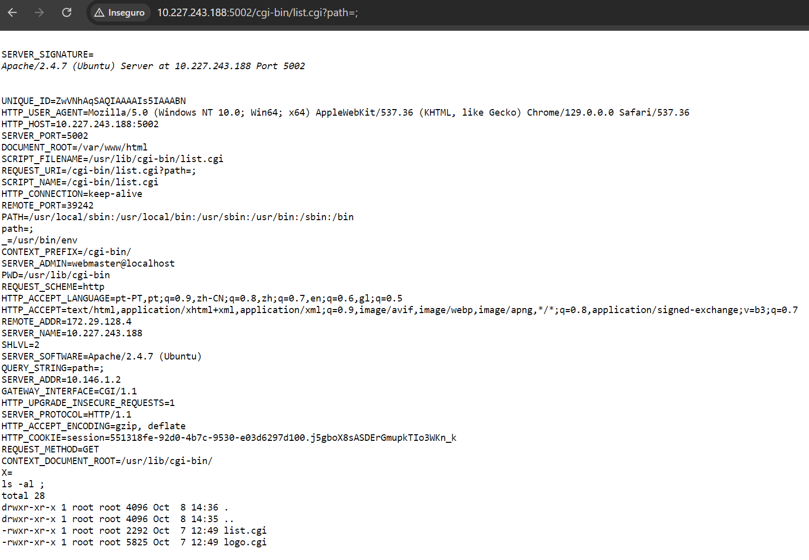
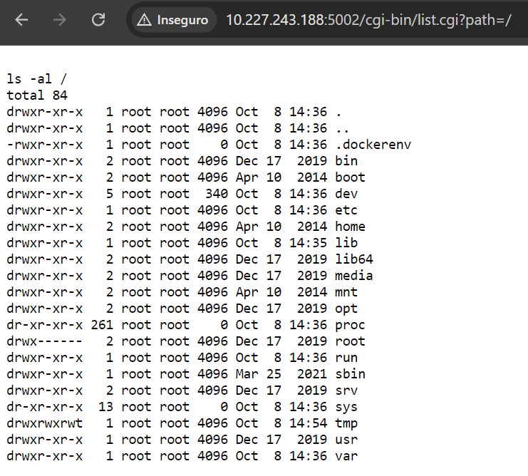
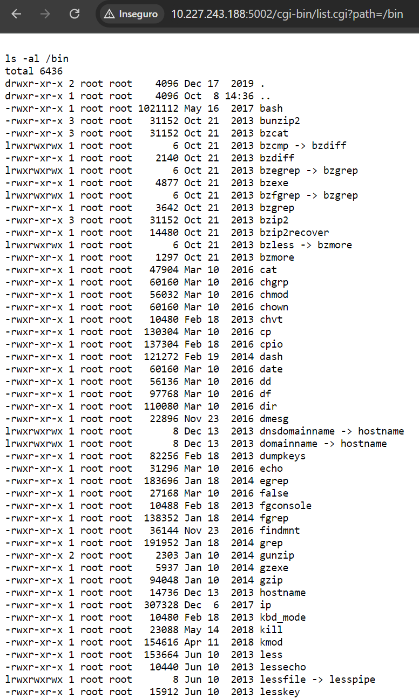
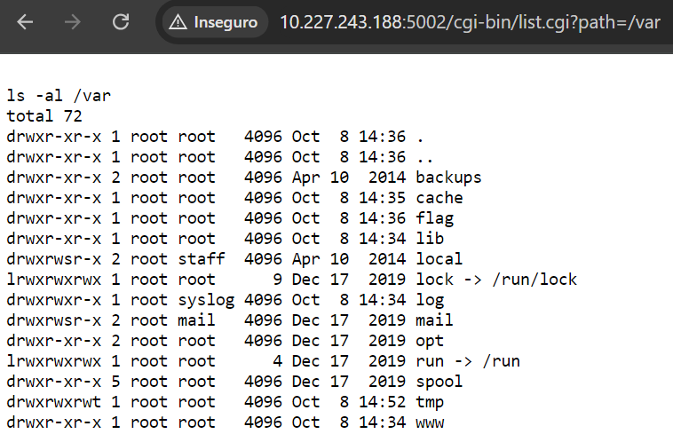
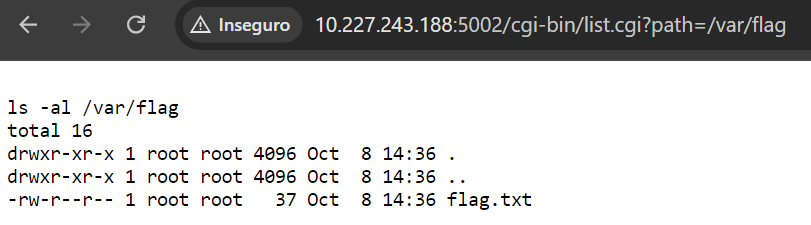
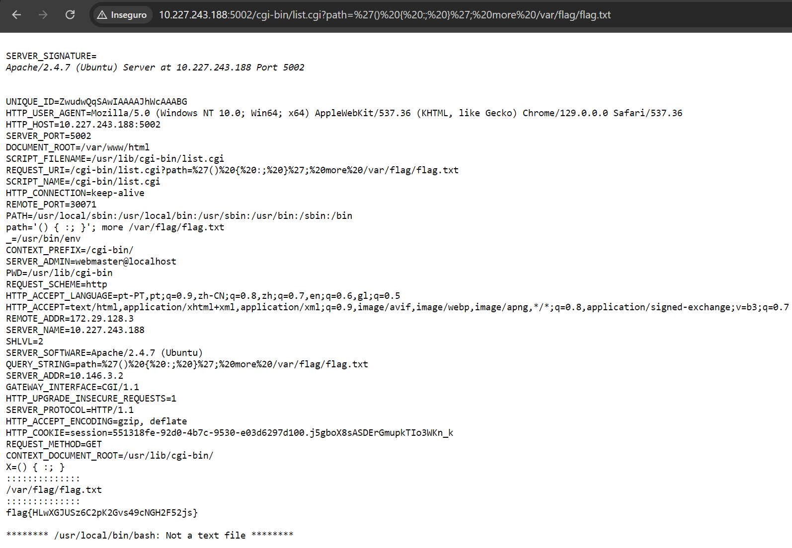
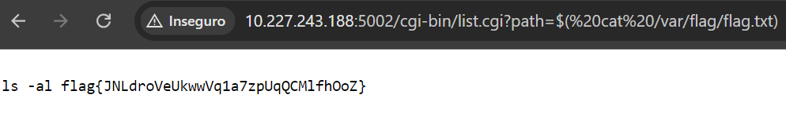

# CTF - Semana 4

**Objetivo**  
Encontrar a flag pretendida no sistema de ficheiros do servidor web.

## 1. Reconhecimento

A partir da informação da página web, podemos identificar qual o software instalado e respetivas versões, entre os quais:

- Apache HTTP Server (2.4.7)
- Bash (4.3)

**Análise de vulnerabilidades**  
Após uma pesquisa, verificou-se o seguinte:

- Apache 2.4.7 -> Sem vulnerabilidades significativas;
- Bash 4.3 -> Existe uma vulnerabilidade de command injection bem conhecida chamada **'Shellshock'** (ou 'Bashdoor'), que permite a execução de comandos através do envio de variáveis de ambiente maliciosas. O CVE correspondente é o CVE-2014-6271.

**FLAG 1:**
flag{CVE-2014-6271}

## 2. Exploração da vulnerabilidade
Com uma breve análise à forma como a vulnerabilidade pode ser explorada, descobrimos que, ao carregar no botão "Enviar", basta introduzir um ; no URL para o servidor mostrar a lista de variáveis de ambiente.

  
*Figura 1 - variáveis de ambiente*

A forma mais típica de explorar a vulnerabilidade Shellshock é com o vetor ```() { :; };```. O URL fica no formato:
```
http://IP:PORT/cgi-bin/list.cgi?path=%27() { :; }%27;COMANDO
```
 
Uma forma alternativa implica adicionar um $ em "path" para possibilitar a injeção de comandos.
O URL fica no formato:
```
http://IP:PORT/cgi-bin/list.cgi?path=$COMANDO
```

**Procura no sistema de ficheiros**  
Como é possível navegar pelo sistema de ficheiros, tentamos procurar por ficheiros suspeitos que pudessem conter a flag.  
Ao definir o path como "..", podemos ir para o diretório acima do diretório atual. Definindo como "../..", vamos para um diretório ainda mais acima. Ao definirmos path como "/", vamos para o diretório raiz.

  
*Figura 2 - subdiretórios do diretório raiz*

A partir do diretório raiz, podemos começar a verificar os subdiretórios e tentar encontrar o ficheiro com a flag (procuramos, por exemplo, subdiretórios ou ficheiros que contenham a palavra "flag"). Abaixo está a listagem de subdiretórios de dois subdiretórios do diretório raiz, nomeadamente "bin" e "var".

  
*Figura 3 - subdiretórios de '/bin'*

  
*Figura 4 - subdiretórios de '/var'*

**No diretório "var", normalmente usado para ficheiros temporários ou que tendem a ser modificados, existe um subdiretório chamado "flag", que poderá conter o ficheiro que procuramos.**

  
*Figura 5 - ficheiros do diretório 'flag'*

Neste diretório, existe um ficheiro de texto chamado "flag.txt", mas precisamos de uma forma de ver o seu conteúdo. Para isto, podemos explorar a vulnerabilidade e injetar comandos como "cat", para mostrar o conteúdo do ficheiro. Para tal, como mostrado anteriormente, podemos injetar a expressão ```() { :; };```, seguida do comando correspondente. O URL fica com o seguinte aspeto:
```
http://IP:PORT/cgi-bin/list.cgi?path=%27()%20{%20:;%20}%27;%20cat%20/var/flag/flag.txt
```

Contudo, quando tentamos o comando "cat", nada é imprimido. Para resolver isso, podemos utilizar outros comandos de leitura de ficheiros, como "head"/"tail" ou "more"/"less". Os primeiros comandos também não funcionam, mas os últimos já fornecem um output diferente, mostrando o conteúdo do ficheiro em baixo.

  
*Figura 6 - obtenção da flag*

O ficheiro de texto contém, de facto, a flag que pretendíamos descobrir.

*Nota: para que o URL funcione corretamente, a palavra "cat" tem de ter espaços em redor, daí os "%20" entre a palavra, referentes ao código ASCII dos espaços.*

Podemos ainda explorar o método alternativo referido anteriormente. Precisamos de definir o path começando por um $ e de seguida introduzir o comando que queremos, entre parêntesis. Assim, o URL fica com o seguinte aspeto:
```
http://IP:PORT/cgi-bin/list.cgi?path=$(%20cat%20/var/flag/flag.txt)
```  

Após a execução do URL, obtivemos o seguinte:

  
*Figura 7 - obtenção da flag com o método alternativo*

Este método consiste em explorar o facto de que, quando a aplicação web executa o comando "ls -al", imprime o próprio comando no topo da página. Ao ser passado o conteúdo de flag.txt como argumento do comando, esse conteúdo (neste caso, a flag) é mostrado como se fosse um argumento legítimo do comando ls.

**FLAG 2:** flag{HLwXGJUSz6C2pK2Gvs49cNGH2F52js}  
flag{JNLdroVeUkwwVq1a7zpUqQCMlfhOoZ}  
flag{rZxTtXToRUhrUZBk2VCuBCfSmymba4} - funcionou anteriormente ao momento da screenshot

## Contramedidas
De modo a evitar a exploração desta vulnerabilidade por atacantes, uma das formas de o fazer é sanitizar o input na variável path do URL, proibindo, por exemplo, padrões como "/.." (directory traversal) e o símbolo do dólar "$" que, como é usado pela bash, pode possibilitar a injeção e a execução de comandos maliciosos dentro do URL. Outra recomendação é limitar ou desativar o uso de scripts CGI (neste caso, list.cgi), pois podem ser potencialmente perigosos, principalmente se dependerem da Bash ou se expuserem variáveis de ambiente. Note-se que a funcionalidade da aplicação web que permite pesquisar por diretórios é muito perigosa, pelo que só deverá existir por motivos educacionais da cadeira.

Adicionalmente, é recomendado ter sempre instalada a versão mais recente da Bash e do Apache, ou de outros programas utilizados. Esta é uma vulnerabilidade antiga e que já foi corrigida por versões mais recentes do software.
