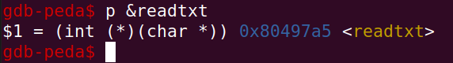
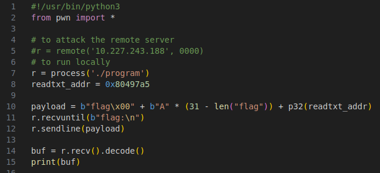
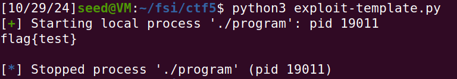
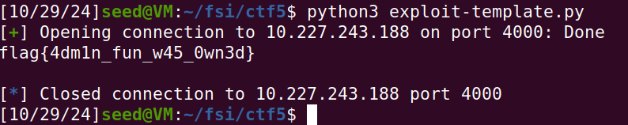

# CTF - Semana 5

**Objetivo**  
Explorar uma vulnerabilidade de buffer-overflow num programa dado de modo a conseguir ler a flag.

## 1. Exploração da vulnerabilidade localmente
Entre outros, são dados dois ficheiros: main.c e exploit-template.c.

De seguida, encontra-se o ficheiro main.c:

``` c
#include <stdio.h>
#include <stdlib.h>

int readtxt(char* name){
  char command[15];
  sprintf(command,"cat %s.txt\0",name);
  system(command);
  return 0;
}

int echo(char *str){
  printf("Echo %s\n",str);
  return 0;
}

int main() {
    void(*fun)(char*);
    char buffer[32];

    printf("Read the rules.\n");
    fun=&readtxt;
    (*fun)("rules");
    fun=&echo;
    printf("Try to unlock the flag:\n");
    fflush(stdout);
    scanf("%45s", &buffer);
    (*fun)(buffer);
    fflush(stdout);
    
    return 0;
}
```

Respondendo às perguntas do enunciado:  

**Existe algum ficheiro que é aberto e lido pelo programa?**  

Analisando o código, podemos ver que o programa usa "readtxt" para abrir e ler um ficheiro rules.txt.

**Existe alguma forma de controlar o ficheiro que é aberto?**  

O nome do ficheiro está definido no código, mas o programa usa system() para executar o comando, o que pode permitir a execução de comandos maliciosos.

**Existe algum buffer-overflow? Se sim, o que é possível fazer?**  

É criado um buffer de 32 bytes, no entanto, na chamada a scanf, é permitida a leitura de 45 bytes (devido a "%45s"), o que representa uma potencial vulnerabilidade de buffer-overflow.

**Criação do payload para explorar a vulnerabilidade**  
Para construir o payload, temos de ter em conta o endereço da chamada a readtxt(). Teremos de usar o gdb:

  
*Figura 1 - endereço de readtxt()*  

Executámos os seguintes comandos no gdb:

```
gdb ./program
break main
run
p &readtxt
```

Após alguma pesquisa, concluímos que, em primeiro lugar, é necessário passar o nome do ficheiro que queremos abrir (neste caso, "flag"), que é o argumento para readtxt. De seguida, o buffer é preenchido com caracteres arbitrários e, finalmente, passamos o endereço de readtxt.

O script do exploit fica assim:

  
*Figura 2 - exploit a usar*  

Utilizando o script localmente, podemos ler o ficheiro flag.txt:  

  
*Figura 3 - exploração da vulnerabilidade localmente*  


## 2. Exploração da vulnerabilidade no servidor
Usando exatamente o mesmo payload da etapa anterior, conseguimos determinar a flag no servidor:  

  
*Figura 4 - exploração da vulnerabilidade no servidor*  

**Flag**  
flag{4dm1n_fun_w45_0wn3d}