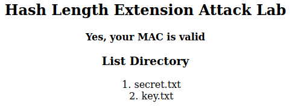
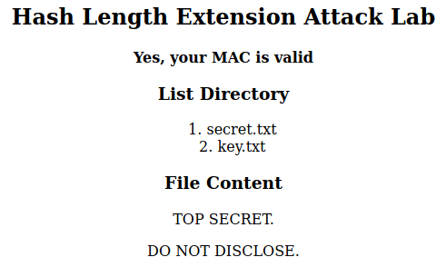
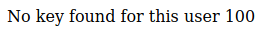
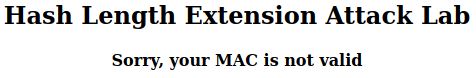
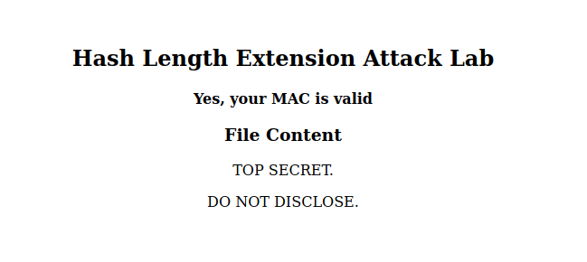

# Trabalho realizado nas Semanas #10 e #11

## Task 1 - Enviar um pedido para os ficheiros listados

Considere cuidadosamente cada um dos passos necessários:

- O servidor só aceita pedidos se o URL dos mesmos for acompanhado com um MAC válido.
- Esse MAC é constituído pelo resultado da função SHA256, quando aplicado a (k:m), onde k é a chave do utilizador, e m é a mensagem a autenticar (o resto do URL).
- Para este primeiro passo temos a password disponível (podem ver em `key.txt`). Para já podemos usar as chaves à vontade para experimentar o sistema. Só na tarefa 3 é que vamos ter que produzir uma autenticação sem esta chave.

Experimente algumas vezes este sistema, para ver como é que ele se comporta com MACs corretos e incorretos, para ganhar alguma prática com o mecanismo.

### Exemplo de Pedido

1. Usando valores normais:
    1. Exemplo 1 -> lstcmd:
      - `k = xciujk`
      - `m = myname=FilipeEsteves`
      - `uid=1005`

     ```bash
     $ echo -n "xciujk:myname=FilipeEsteves&uid=1005&lstcmd=1" | sha256sum
 
     f1ed3eb9a72ebefc68f1a0039ef3aa9ee50d569ff72459cbdc7b6e36d2f5a618
     ```

     Pedido HTTPS:

     ```bash
     http://www.seedlab-hashlen.com/?myname=FilipeEsteves&uid=1005&lstcmd=1&mac=f1ed3eb9a72ebefc68f1a0039ef3aa9ee50d569ff72459cbdc7b6e36d2f5a618
     ```

    Resposta:

    

    2. Exemplo 2 -> lstcmd:
      - `k = 123456`
      - `m = myname=FilipeEsteves`
      - `uid=1001`

     ```bash
     $ echo -n "123456:myname=FilipeEsteves&uid=1001&lstcmd=1" | sha256sum

     b6b88b30f56b43b0f6bce40200bb5f99aa2bb03fb0116a63d0e51fcd935359f7
     ```

     Pedido HTTPS:

     ```bash
     http://www.seedlab-hashlen.com/?myname=FilipeEsteves&uid=1001&lstcmd=1&mac=b6b88b30f56b43b0f6bce40200bb5f99aa2bb03fb0116a63d0e51fcd935359f7
     ```

     Resposta:

     

    3. Exemplo 3 -> download:
      - `k = 123456`
      - `m = myname=FilipeEsteves`
      - `uid=1001`

     ```bash
     $ echo -n "123456:myname=FilipeEsteves&uid=1001&lstcmd=1&download=secret.txt" | sha256sum
 
     3eb9e833b99f1f2e40a785e9aaed5348124332c29c8bc9725ccd86a617fe77b3
     ```

     Pedido HTTPS:

     ```bash
         http://www.seedlab-hashlen.com/?myname=FilipeEsteves&uid=1001&lstcmd=1&download=secret.txt&mac=3eb9e833b99f1f2e40a785e9aaed5348124332c29c8bc9725ccd86a617fe77b3
     ```

     Resposta:

     

2. Se metermos valores errados
    1. Usando uid diferente dos listados no fixeiro key.txt:
      - `k = 123456`
      - `m = myname=FilipeEsteves`
      - `uid=100`

    ```bash
    $ echo -n "123456:myname=FilipeEsteves&uid=100&lstcmd=1" | sha256sum
    192b15adae3ecb99ba5247763881a9888c0cee7a19305ca3a6095cffedebf190
    ```

    HTTPS request:

    ```bash
    http://www.seedlab-hashlen.com/?myname=FilipeEsteves&uid=100&lstcmd=1&mac=192b15adae3ecb99ba5247763881a9888c0cee7a19305ca3a6095cffedebf190
    ```

    Resposta:

    

    2. Usando uma chave diferente:
      - `k = 7654321`
      - `m = myname=FilipeEsteves`
      - `uid=1001`

    ```bash
    $ echo -n "7654321:myname=FilipeEsteves&uid=1001&lstcmd=1" | sha256sum
    80880a3adf4e1a53d24debc6722dd359c8ca9c4b3c8e2d218ca9304dd6de66b9
    ```

    HTTPS request:

    ```bash
    http://www.seedlab-hashlen.com/?myname=FilipeEsteves&uid=1001&lstcmd=1&mac=80880a3adf4e1a53d24debc6722dd359c8ca9c4b3c8e2d218ca9304dd6de66b9
    ```

    Resposta:

    

## Task 2

- Mensagem a ser usada.
  
  Esta mesagem tem 45 bytes

  ```bash
  123456:myname=FilipeEsteves&uid=1001&lstcmd=1
  ```

- Tamanho do padding.
  
  O padding é calculado da seguinte forma:

  ```bash
    1 byte para o '\x80'
    N bytes de zeros
    2 bytes para o tamanho da mensagem
  ```

  A mensagem tem padding de tamanho:`64 - (45 + 1 + 2) = 16 bytes`

- Tamanho da mensagem.
  
  O tamanho da mensagem é de `45 × 8 = 360 bits = 0x0168`

  A mensagem encoded com big-edian order: `\x00\x00\x00\x00\x00\x00\x01\x68`

- Mensagem com padding.

  A mensagem com padding é:

  ```bash
  Padding = "\x80"
          + "\x00" × 16
          + "\x01\x68"
  ```

- URL encoded.

  ```perl
  %80%00%00%00%00%00%00%00%00%00%00%00%00%00%00%00%00%01%68
  ```

## Task 3
- Usando uid diferente dos listados no fixeiro key.txt:
  - `k = 123456`
  - `m = myname=FilipeEsteves`
  - `uid=1001`

- Mensagem original

  ```bash
  $ echo -n "123456:myname=FilipeEsteves&uid=1001&lstcmd=1" | sha256sum

  b6b88b30f56b43b0f6bce40200bb5f99aa2bb03fb0116a63d0e51fcd935359f7  
  ```

- Usando o Script  Length_ext.c

  Thes Script Computes the mac for the new massage with the extra message appended.

  ```c
  /* length_ext.c */
  #include <stdio.h>
  #include <arpa/inet.h>
  #include <openssl/sha.h>

  int main(int argc, const char *argv[])
  {
    int i;
    unsigned char buffer[SHA256_DIGEST_LENGTH];
    SHA256_CTX c;

    SHA256_Init(&c);
    for(i=0; i<64; i++)
      SHA256_Update(&c, "*", 1);
    // b6b88b30 f56b43b0 f6bce402 00bb5f99 aa2bb03f b0116a63 d0e51fcd 935359f7
    // MAC of the original message M (padded)      
    c.h[0] = htole32(0xb6b88b30);
    c.h[1] = htole32(0xf56b43b0);
    c.h[2] = htole32(0xf6bce402);
    c.h[3] = htole32(0x00bb5f99);
    c.h[4] = htole32(0xaa2bb03f);
    c.h[5] = htole32(0xb0116a63);
    c.h[6] = htole32(0xd0e51fcd);
    c.h[7] = htole32(0x935359f7);

    // Append additional message
    SHA256_Update(&c, "&download=secret.txt", 20);
    SHA256_Final(buffer, &c);

    for(i = 0; i < 32; i++) {
      printf("%02x", buffer[i]);
    }
    printf("\n");
    return 0;
  }
  ```

  Compilar o script:

  ```bash
  $ gcc length_ext.c -o length_ext -lcrypto
  ```

  Executar o script:

  ```bash
  $ ./length_ext

  7ca339e024eaebfb926d9dc9a4f43dc567bd55f51fe8a2a15392556fab90a05f
  ```

- Pedido HTTPS:

  ```bash
  http://www.seedlab-hashlen.com/?myname=FilipeEsteves&uid=1001&lstcmd=1%80%00%00%00%00%00%00%00%00%00%00%00%00%00%00%00%00%01%68&download=secret.txt&mac=7ca339e024eaebfb926d9dc9a4f43dc567bd55f51fe8a2a15392556fab90a05f
  ```

  Resposta:

  
