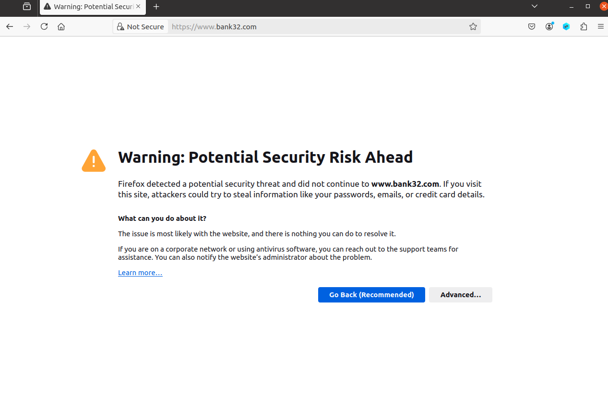
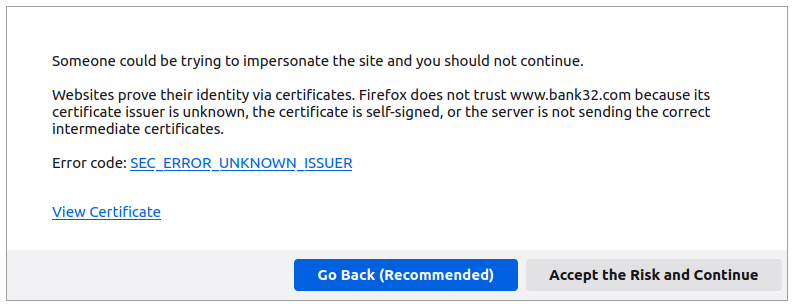
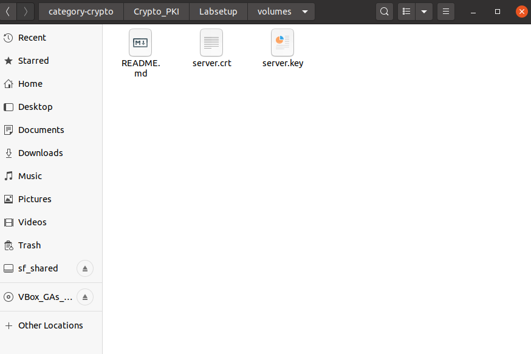
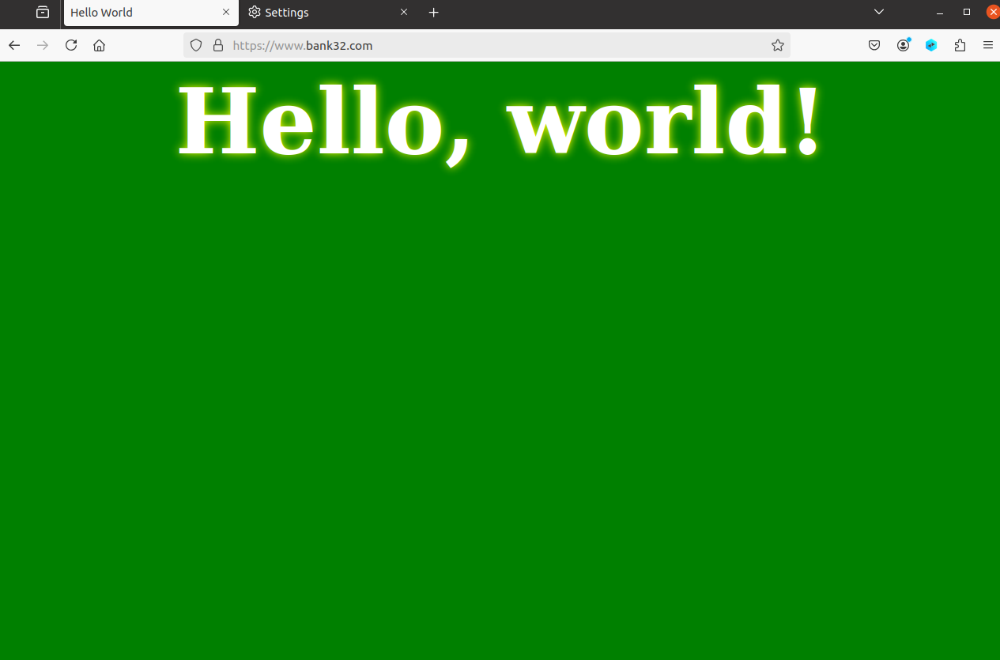
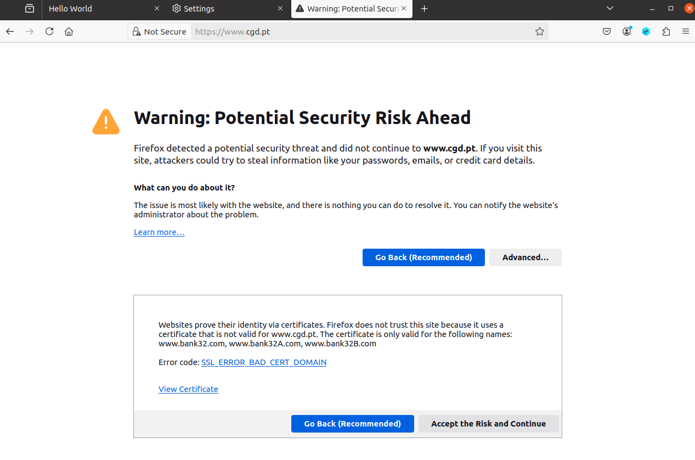
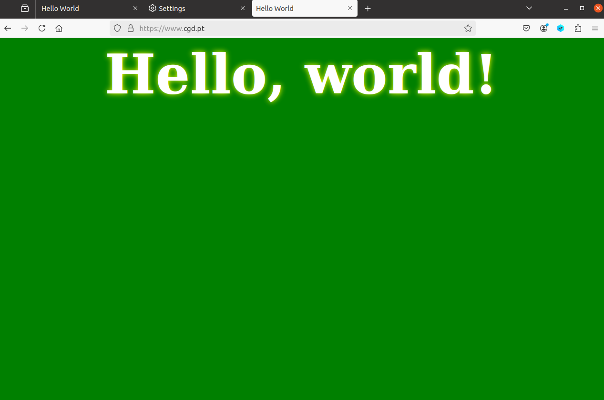

# Logbook 11 - Public Key Infrastructures

## Task 1 - Tornar-se Certificate Authority (CA)
Passos:
- Copiar o ficheiro ```/usr/lib/ssl/openssl.cnf``` para o diretório local;
- Retirar o comentário em ```#unique_subject = no```;
- Criar os ficheiros index.txt e serial, escrevendo neste último um número qualquer;
- Correr o comando ```openssl req -x509 -newkey rsa:4096 -sha256 -days 3650 \ -keyout ca.key -out ca.crt```;
- Verificar o conteúdo com ```openssl x509 -in ca.crt -text -noout``` e ```openssl rsa -in ca.key -text -noout```.

**Parte que indica que se trata de um CA´s certificate**  
Em ca.crt, existe um parâmetro booleano que especifica se o certificado é ou não um CA´s certificate.
```
X509v3 Basic Constraints: critical
    CA:TRUE
```

**Parte que indica que é um self-signed certificate**  
Em ca.crt, temos de verificar se o Issuer e o Subject são idênticos. Em caso afirmativo, como no abaixo, podemos concluir que se trata de um self-signed certificate.

```
Issuer: C = PT, ST = Porto, L = Porto, O = Universidade do Porto, OU = FEUP, CN = FSI
        (...)
Subject: C = PT, ST = Porto, L = Porto, O = Universidade do Porto, OU = FEUP, CN = FSI
```

**Valores no algoritmo RSA**
- Public exponent *e*: ```publicExponent: 65537 (0x10001)```

- Private exponent *d*: ```privateExponent:
    00:8e:e5:7a:93:e5:1b:85:bf:2f:80:81:db:7a:4b:
    2b:d9:10:86:a2:06:71:6a:87:25:a9:af:8c:0e:77...```

- Modulus *n*: p x q

- Primes *p* e *q*: 
    ```
    prime1:
    00:db:69:bb:37:b5:58:03:24:ae:e3:5b:8f:a0:de:
    4b:2a:9e:ac:b8:cb:5e:8a:bd:d4:16:d8:df:e1:45...
    ```
    e 
    ```
    prime2:
    00:d3:38:42:b0:c0:d0:d6:ef:f4:38:43:4d:1a:83:
    c1:3c:bc:9e:ad:82:a7:fd:cf:65:db:25:9a:b5:07...
    ```

## Task 2 - Gerar um pedido de certificado para um servidor web
Comando (ajustar o servidor web):
```
openssl req -newkey rsa:2048 -sha256 \
-keyout server.key -out server.csr \
-subj "/CN=www.bank32.com/O=Bank32 Inc./C=US" \
-passout pass:dees
```

Adicionar nomes alternativos ao comando req:
```
openssl req -newkey rsa:2048 -sha256 \
-keyout server.key -out server.csr \
-subj "/CN=www.bank32.com/O=Bank32 Inc./C=US" \
-passout pass:dees -addext "subjectAltName = DNS:www.bank32.com, \
DNS:www.bank32A.com, \
DNS:www.bank32B.com"
```

Com o último comando, a seguinte secção aparece:  
```
Requested Extensions:
    X509v3 Subject Alternative Name: 
        DNS:www.bank32.com, DNS:www.bank32A.com, DNS:www.bank32B.com
```

## Task 3 - Gerar um certificado para um servidor
Antes de executar o comando: Retirar o comentário em ```#copy_extensions = copy```.

Comando:
```
openssl ca -config myCA_openssl.cnf -policy policy_anything \
-md sha256 -days 3650 \
-in server.csr -out server.crt -batch \
-cert ca.crt -keyfile ca.key
```

Abrimos o conteúdo do certificado com ```openssl x509 -in server.crt -text -noout``` e verificamos se os nomes alternativos são incluídos:

```
X509v3 Subject Alternative Name: 
    DNS:www.bank32.com, DNS:www.bank32A.com, DNS:www.bank32B.com
```

## Task 4 - Certificados para websites HTTPS baseados em Apache
A configuração para um website já está criada na VM. Para iniciar o servidor, basta introduzir os seguintes comandos na shell do container:

- ```a2enmod ssl``` (ativar o modo SSL)
- ```a2ensite bank32_apache_ssl``` (ativar os sites incluídos no ficheiro)
- ```service apache2 start``` (iniciar o servidor)

O website estará a funcionar, porém o browser mostrará um alerta de que o website não é seguro:

  
*Figura 1 - alerta de segurança*  

Podemos verificar a razão do alerta clicando em "Advanced":

  
*Figura 2 - motivo do alerta*  

O Firefox diz-nos que não reconhece o Issuer como Trusted CA. Para resolver este problema, temos de importar o certificado que criámos para o browser. Para tal, temos de ir a Settings > Privacy & Security > Certificates > View Certificates e adicionar o nosso certificado na aba Authorities.

Temos ainda de copiar o certificado para o diretório "volumes" (partilhado entre a VM e o container):

  
*Figura 3 - diretório "volumes"* 

Quando estes passos estiverem concluídos, é possível aceder ao site sem avisos:

  
*Figura 4 - website* 

## Task 5 - Ataque Man-In-The-Middle
O objetivo é demonstrar que o PKI é capaz de mitigar um ataque Man-In-The-Middle e como o faz.

Na Task anterior, configurámos um site HTTPS. Vamos utilizar esse site como se fosse um site malicioso.

**DNS Cache Poisoning**  
O guião aborda esta tática para, quando um utilizador tentar entrar no site que pretende, como o do seu banco, direcioná-lo para o nosso site malicioso. Para adicionar realismo ao ataque, vamos usar um site bancário real adicionando a seguinte linha ao ficheiro /etc/hosts:

```
10.9.0.80 www.cgd.pt
```

No ficheiro bank32_apache_ssl.conf, alterámos o "ServerName" para www.cgd.pt.

Ao tentar abrir o endereço do site, aparece o seguinte alerta:

  
*Figura 5 - alerta de segurança* 

Este erro é um mecanismo de segurança do browser para alertar o utilizador que o hostname www.cgd.pt não faz parte da lista de hostnames para os quais o certificado é válido, alertando que o certificado é para um domínio diferente ou é self-signed. Assim, a infraestrutura PKI previne o ataque.

## Task 6 - Ataque Man-In-The-Middle com CA comprometido
Vamos assumir que um atacante obteve acesso à chave privada do CA criado na Task 1. Nesta situação, podemos simplesmente adicionar o domínio www.cgd.pt à lista de hostnames do certificado e voltar a gerá-lo. 

```
Certificate:
    Data:
        Version: 3 (0x2)
        Serial Number: 4098 (0x1002)
        Signature Algorithm: sha256WithRSAEncryption
        Issuer: C=PT, ST=Porto, L=Porto, O=Universidade do Porto, OU=FEUP, CN=FSI
        Validity
            Not Before: Dec  9 09:32:33 2024 GMT
            Not After : Dec  7 09:32:33 2034 GMT
        Subject: C=US, O=Bank32 Inc., CN=www.cgd.pt
        Subject Public Key Info:
            Public Key Algorithm: rsaEncryption
                RSA Public-Key: (2048 bit)
                Modulus:
                    00:c4:0d:b8:ed:76:c6:10:80:8f:f3:89:80:3b:92:
                    8b:5c:6f:c3:1d:00:fb:e9:53:ba:a6:20:f6:fa:95:
                    (...)
```

Vamos tentar aceder a www.cgd.pt novamente:

  
*Figura 6 - ataque bem-sucedido* 

Desta vez, o browser não mostrou quaisquer avisos porque confia no servidor do atacante, pois o certificado é de um Trusted CA e o hostname no certificado corresponde ao URL visitado.
