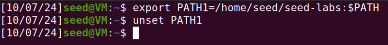
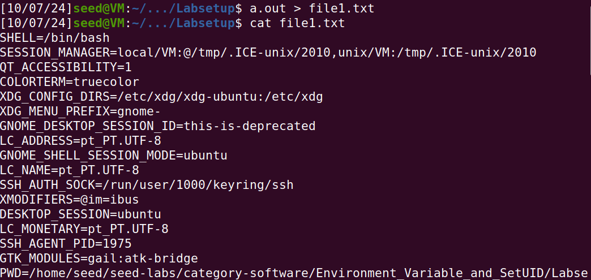
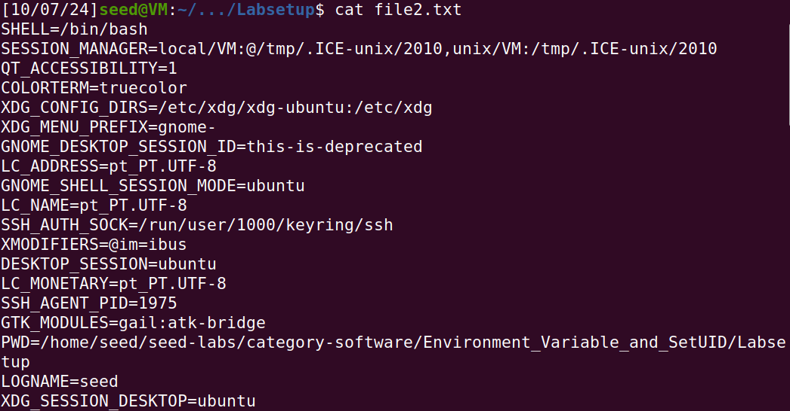
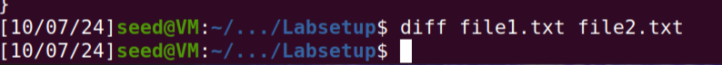
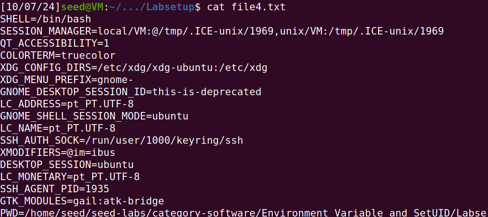
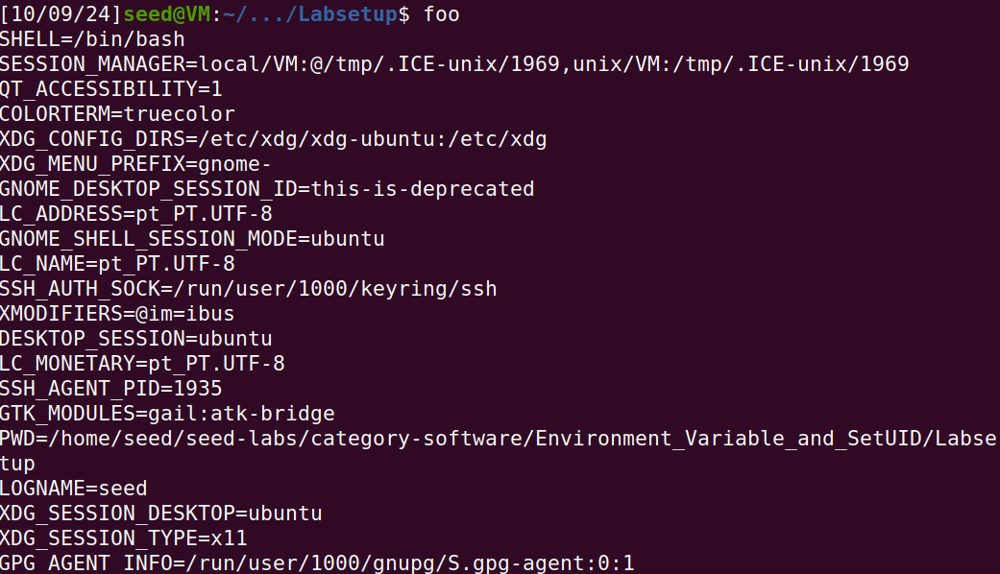
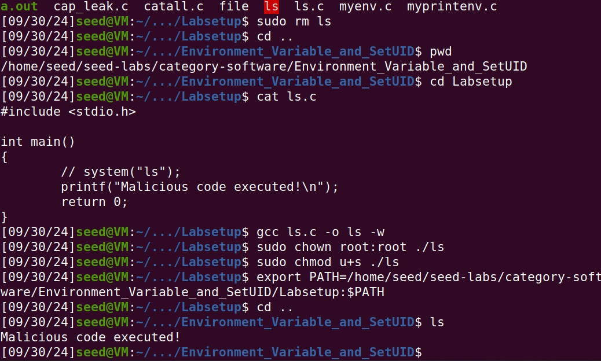
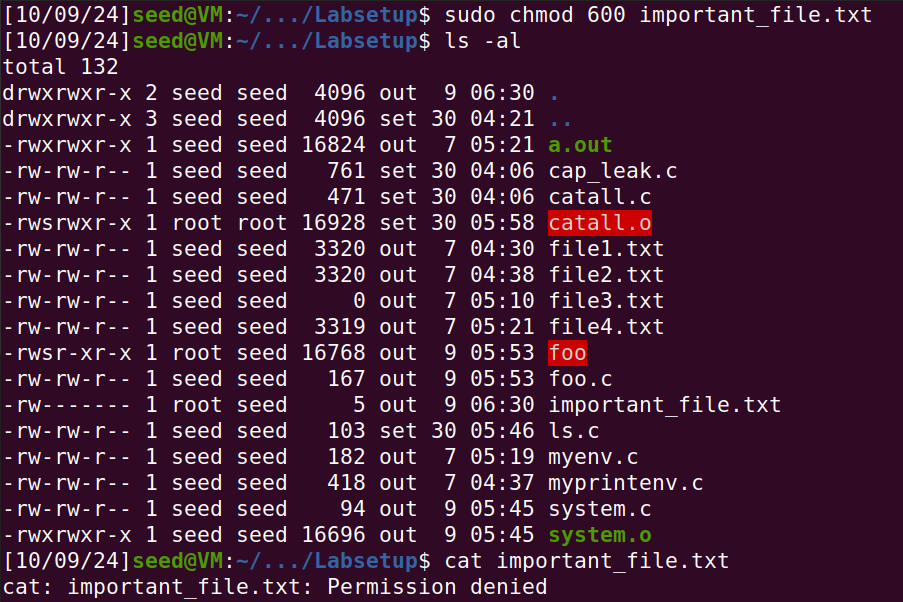
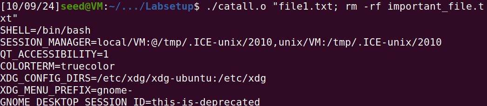
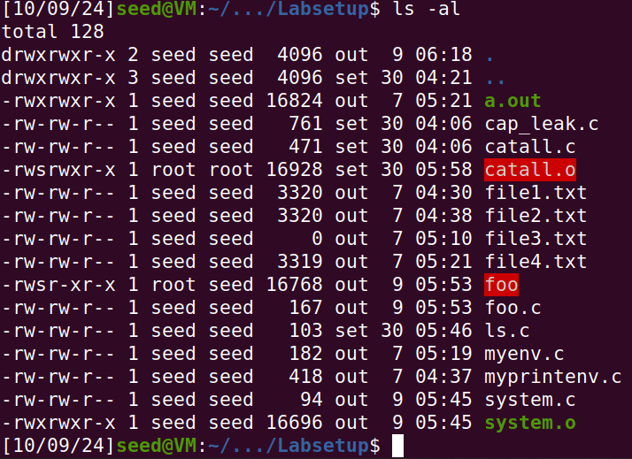

# Trabalho realizado nas Semanas #4 e #5

## Task 1 - Manipulação de Variáveis de Ambiente
Testar os comandos env, export e unset.



## Task 2 - Variáveis de Ambiente entre Processos Pai e Filho
**Passo 1:** compilar, executar e guardar o output do programa  

Na imagem abaixo podemos concluir que o programa retorna as variáveis de ambiente, tal como o comando env.



**Passo 2:** alterar o programa  

Conforme pedido, alterou-se o programa ao trocar a posição de printenv() do processo filho para o processo pai.



**Passo 3:** comparar os dois outputs



Como podemos verificar, o output é igual para ambas as versões do código, o que sugere que os processos filhos herdam as variáveis de ambiente do processo pai.

## Task 3 - O comando execve()
**Passo 1:** compilar e executar o programa  

Observamos que o programa fornece um output vazio, já que não estão a ser passadas quaisquer variáveis de ambiente na chamada de execve().  
O 2º argumento da chamada é NULL:
```
execve("/usr/bin/env", argv, NULL);
```

**Passo 2:** alterar a chamada de execve()  

A chamada de execve() será a seguinte:
```
execve("/usr/bin/env", argv, environ);
```
Desta vez, não estaremos a passar argumentos vazios.



Agora, o programa imprime normalmente as variáveis de ambiente.

**Passo 3:** conclusões  

Podemos concluir que o programa obtém as variáveis de ambiente através de um apontador "environ", que contém as variáveis de ambiente do processo atual.

## Task 4 - O comando system()
Programa a compilar e executar:
``` c
#include <stdio.h>
#include <stdlib.h>

int main()
{
  system("/usr/bin/env");
  return 0 ;
}
```

Ao executar o programa, verificamos que retorna o array que contém as variáveis de ambiente. De facto, as variáveis de ambiente do processo são herdadas por /bin/sh.

## Task 5 - Variáveis de Ambiente e Programas Set-UID
**Passos 1 e 2:** compilar o programa, mudar o owner para "root" e tornar o programa Set-UID  

Este programa imprime o array das variáveis de ambiente:
``` c
#include <stdio.h>
#include <stdlib.h>

extern char **environ;
int main()
{
  int i = 0;
  while (environ[i] != NULL) {
    printf("%s\n", environ[i]);
    i++;
  }
}
```

```
$ gcc foo.c -o foo
$ sudo chown root foo
$ sudo chmod 4755 foo
```

**Passo 3:** definir variáveis de ambiente e executar o programa Set-UID 

```
export MYENV=/home/seed/seed-labs/category-software/Environment_Variable_and_SetUID/Labsetup
```



Como a imagem mostra, basta escrever o nome do programa no terminal para o programa ser executado. Observamos que a variável de ambiente MYENV definida anteriormente não é mostrada na execução do programa. Quaisquer alterações a outras variáveis, como PATH, também são eliminadas. Isto deve-se a algumas proteções existentes de modo a evitar possíveis ataques.


## Task 6 - A Variável PATH e Programas Set-UID
**Passo 1:** compilar e executar o programa  
```
gcc ls.c -o ls -w  
./ls
```

O programa executa o comando ls, de system("ls"), mostrando os conteúdos do diretório atual. Alteramos o programa de modo a imprimir a frase "Malicious code executed!" ao invés de chamar system("ls"), para que a sua execução seja mais evidente.

**Passo 2:** Mudar o owner para "root" e tornar o programa num Set-UID  

Mudar o owner: 
```
sudo chown root:root ./ls
```  
Fazer do programa um Set-UID: 
```
sudo chmod u+s ./ls
```

**Passo 3:** Modificar PATH  
```
export PATH=/home/seed/seed-labs/category-software/Environment Variable and SetUID/Labsetup:$PATH
```

**Passo 4:** Experimentar o comando "ls"  

Sem link de /bin/zsh com /bin/sh: executa o comando de sistema normalmente  
Com link de /bin/zsh com /bin/sh (sudo ln -sf /bin/zsh /bin/sh): executa o nosso programa

*Nota:* as alterações ao PATH só se aplicam na sessão atual, bastando fechar e reabrir o terminal para as alterações serem removidas.  

Na imagem seguinte, podemos ver a execução bem sucedida do nosso código ao chamar o comando ls. Na imagem, é chamado o comando cd para ir para o diretório acima do atual, com o objetivo de comprovar o código é executado independentemente do diretório atual.




## Task 8 - Programas Externos usando system() vs execve()
**Passo 1:** comprometer a integridade do sistema usando system()  

Para testar este cenário, criámos um ficheiro cujo owner é root e apenas o root pode lê-lo e modificá-lo. Com o programa dado, vamos tentar remover esse ficheiro.

```
touch important_file.txt
sudo chown root important_file.txt
sudo chmod 600 important_file.txt
```



É possível injetar comandos ao introduzir um ";" dentro do argumento, seguido do comando que pretendemos executar (sem necessidade de "sudo"). A chamada do programa fica com o seguinte aspeto:

```
./catall.o "file1.txt; rm -rf important_file.txt"
```

O programa imprime na mesma o conteúdo do ficheiro passado no argumento. **Note-se que o ficheiro usado file1.txt é da Task 2, Passo 1, logo contém as variáveis de ambiente.**



Mas algo muito mais interessante aconteceu: o ficheiro que criámos foi efetivamente eliminado.



Concluimos que, nesta situação, um utilizador sem privilégios root pode de facto comprometer a integridade do sistema usando o programa. Tal deve-se ao facto de o programa chamar system() ao invés de execve(), que seria uma alternativa mais segura e que poderia evitar a injeção de comandos no argumento. Esta alternativa é testada no passo 2 desta Task.