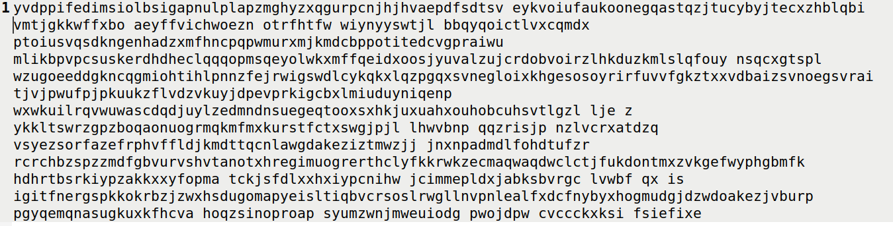

# Trabalho realizado nas Semanas #9 e #10

## Task 1 - Análise de Frequência
É dada uma mensagem encriptada com uma cifra de substituição de letras. Também é fornecido um script que conta as ocorrências de letras e de sequências de 2 e 3 letras. O objetivo é desencriptar a mensagem tendo em conta essas estatísticas.

Encontra-se abaixo um excerto dessa mensagem, guardada em ciphertext.txt:

```
ytn xqavhq yzhu  xu qzupvd ltmat qnncq vgxzy hmrty vbynh ytmq ixur qyhvurn
vlvhpq yhme ytn gvrrnh bnniq imsn v uxuvrnuvhmvu yxx

ytn vlvhpq hvan lvq gxxsnupnp gd ytn pncmqn xb tvhfnd lnmuqynmu vy myq xzyqny
vup ytn veevhnuy mceixqmxu xb tmq bmic axcevud vy ytn nup vup my lvq qtvenp gd
ytn ncnhrnuan xb cnyxx ymcnq ze givasrxlu eximymaq vhcavupd vaymfmqc vup
v uvymxuvi axufnhqvymxu vq ghmnb vup cvp vq v bnfnh phnvc vgxzy ltnytnh ytnhn
xzrty yx gn v ehnqmpnuy lmubhnd ytn qnvqxu pmpuy ozqy qnnc nkyhv ixur my lvq
nkyhv ixur gnavzqn ytn xqavhq lnhn cxfnp yx ytn bmhqy lnnsnup mu cvhat yx
vfxmp axubimaymur lmyt ytn aixqmur anhncxud xb ytn lmuynh xidcemaq ytvusq
ednxuratvur

xun gmr jznqymxu qzhhxzupmur ytmq dnvhq vavpncd vlvhpq mq txl xh mb ytn
anhncxud lmii vpphnqq cnyxx nqenamviid vbynh ytn rxipnu rixgnq ltmat gnavcn
v ozgmivuy axcmurxzy evhyd bxh ymcnq ze ytn cxfncnuy qenvhtnvpnp gd 
exlnhbzi txiidlxxp lxcnu ltx tnienp hvmqn cmiimxuq xb pxiivhq yx bmrty qnkzvi
tvhvqqcnuy vhxzup ytn axzuyhd
```

Ao correr o script, parte das estatísticas de ocorrências são as seguintes:
```
1-gram          2-gram          3-gram
n: 488          yt: 115         ytn: 78
y: 373          tn: 89          vup: 30
v: 348          mu: 74          mur: 20
x: 291          nh: 58          ynh: 18
u: 280          vh: 57          xzy: 16
q: 276          hn: 57          mxu: 14
m: 264          vu: 56          gnq: 14
h: 235          nq: 53          ytv: 13
t: 183          xu: 52          nqy: 13
i: 166          up: 46          vii: 13
p: 156          xh: 45          bxh: 13
a: 116          yn: 44          lvq: 12
c: 104          np: 44          nuy: 12
```

*Nota: a mensagem está em inglês, pelo que as frequências devem ser analisadas para esta língua.*

Recorrendo à Wikipédia, como o guião sugere, obtemos as ocorrências mais comuns para a língua inglesa:

  
*Figura 1 - ocorrências de letras*  

  
*Figura 2 - ocorrências de bigramas*  

  
*Figura 3 - ocorrências de trigramas*  

Comparando as ocorrências na mensagem com as estatísticas gerais, podemos inicialmente considerar que:
- 'n' corresponde ao 'e'
- 'ytn' corresponde a 'the', logo 'y' corresponde a 't' e 't' corresponde a 'h'
- 'vup' provavelmente corresponde a 'and', logo é provável que 'v' corresponda a 'a', 'u' corresponda a 'b' e 'p' corresponda a 'd'
- 'mu' provavelmente corresponde a 'in', logo 'm' corresponde a 'i'
- 'mur' provavelmente corresponde a 'ing', logo 'r' corresponde a 'g'
- 'x' provavelmente corresponde a 'o'

Podemos usar o seguinte comando para ir decifrando a mensagem, guardando o resultado em out.txt:

```
tr 'LETRAS CIFRADAS' 'LETRAS REAIS' < ciphertext.txt > out.txt
```

Portanto, podemos substituir as letras mencionadas acima:
```
tr 'nytvupmrx' 'ethandigo' < ciphertext.txt > out.txt
```

Abaixo encontra-se o mesmo excerto da mensagem, agora com as traduções especificadas acima:

```
the oqaahq tzhn  on qzndad lhiah qeecq agozt hight abteh thiq iong qthange
alahdq thie the gaggeh beeiq iise a nonagenahian too

the alahdq haae laq goosended gd the deciqe ob hahfed leinqtein at itq oztqet
and the aeeahent iceioqion ob hiq biic aoceand at the end and it laq qhaeed gd
the ecehgenae ob cetoo ticeq ze giaasgoln eoiitiaq ahcaandd aatifiqc and
a nationai aonfehqation aq ghieb and cad aq a befeh dheac agozt lhetheh thehe
ozght to ge a eheqident linbhed the qeaqon didnt ozqt qeec ektha iong it laq
ektha iong geaazqe the oqaahq lehe cofed to the bihqt leesend in cahah to
afoid aonbiiating lith the aioqing aehecond ob the linteh oidceiaq thansq
edeongahang

one gig jzeqtion qzhhoznding thiq deahq aaadecd alahdq iq hol oh ib the
aehecond liii addheqq cetoo eqeeaiaiid abteh the goiden giogeq lhiah geaace
a ozgiiant aocingozt eahtd boh ticeq ze the cofecent qeeahheaded gd 
eolehbzi hoiidlood locen lho heieed haiqe ciiiionq ob doiiahq to bight qekzai
hahaqqcent ahoznd the aoznthd
```

Os passos seguintes envolvem analisar a mensagem parcial e tentar formar palavras ou frases que façam sentido. Por exemplo:
- 'One gig' provavelmente será 'One big' ('g' -> 'b')
- 'Hight' provavelmente será 'right' ('h' -> 'r')
- 'Thiq' provavelmente será 'this' ('q' -> 's')
- 'Nationai' provavelmente será 'national' ('i' -> 'l')
- 'Thansq' provavelmente será 'thanks' ('s' -> 'k')

Vamos atualizar o comando:
```
tr 'nytvupmrxghqis' 'ethandigobrslk' < ciphertext.txt > out.txt
```

A mensagem já parece começar a fazer sentido:
```
the osaars tzrn  on szndad lhiah seecs abozt right abter this long strange
alards trie the bagger beels like a nonagenarian too

the alards raae las bookended bd the decise ob harfed leinstein at its oztset
and the aeearent icelosion ob his bilc aoceand at the end and it las shaeed bd
the ecergenae ob cetoo tices ze blaakgoln eolitias arcaandd aatifisc and
a national aonfersation as brieb and cad as a befer dreac abozt lhether there
ozght to be a eresident linbred the season didnt ozst seec ektra long it las
ektra long beaazse the osaars lere cofed to the birst leekend in carah to
afoid aonbliating lith the alosing aerecond ob the linter oldceias thanks
edeongahang

one big jzestion szrroznding this dears aaadecd alards is hol or ib the
aerecond lill address cetoo eseeaialld abter the golden globes lhiah beaace
a ozbilant aocingozt eartd bor tices ze the cofecent seearheaded bd 
eolerbzl holldlood locen lho heleed raise cillions ob dollars to bight sekzal
harasscent aroznd the aozntrd
```

Algumas palavras, como 'osaars' e 'golden globes' sugerem que o tema da mensagem são os Óscares, pelo que:
- 'Osaars' provavelmente será 'oscars' ('a' -> 'c')
- 'Alards' provavelmente será 'awards' ('l' -> 'w')
- 'Abozt' provavelmente será 'about' ('z' -> 'u')
- 'Abter' provavelmente será 'after' ('b' -> 'f')
- 'Jzestion' provavelmente será 'question' ('j' -> 'q')

Substituindo as novas letras:
```
tr 'nytvupmrxghqisalzbj' 'ethandigobrslkcwufq' < ciphertext.txt > out.txt
```

O excerto passa a ser o seguinte:
```
the oscars turn  on sundad which seecs about right after this long strange
awards trie the bagger feels like a nonagenarian too

the awards race was bookended bd the decise of harfed weinstein at its outset
and the aeearent icelosion of his filc coceand at the end and it was shaeed bd
the ecergence of cetoo tices ue blackgown eolitics arccandd actifisc and
a national confersation as brief and cad as a fefer dreac about whether there
ought to be a eresident winfred the season didnt oust seec ektra long it was
ektra long because the oscars were cofed to the first weekend in carch to
afoid conflicting with the closing cerecond of the winter oldceics thanks
edeongchang

one big question surrounding this dears acadecd awards is how or if the
cerecond will address cetoo eseecialld after the golden globes which becace
a oubilant cocingout eartd for tices ue the cofecent seearheaded bd 
eowerful holldwood wocen who heleed raise cillions of dollars to fight sekual
harasscent around the countrd
```

Continuamos este processo até decifrar a mensagem completa, que é a seguinte:

```
the oscars turn  on sunday which seems about right after this long strange
awards trip the bagger feels like a nonagenarian too

the awards race was bookended by the demise of harvey weinstein at its outset
and the apparent implosion of his film company at the end and it was shaped by
the emergence of metoo times up blackgown politics armcandy activism and
a national conversation as brief and mad as a fever dream about whether there
ought to be a president winfrey the season didnt just seem extra long it was
extra long because the oscars were moved to the first weekend in march to
avoid conflicting with the closing ceremony of the winter olympics thanks
pyeongchang

one big question surrounding this years academy awards is how or if the
ceremony will address metoo especially after the golden globes which became
a jubilant comingout party for times up the movement spearheaded by 
powerful hollywood women who helped raise millions of dollars to fight sexual
harassment around the country

signaling their support golden globes attendees swathed themselves in black
sported lapel pins and sounded off about sexist power imbalances from the red
carpet and the stage on the air e was called out about pay inequity after
its former anchor catt sadler quit once she learned that she was making far
less than a male cohost and during the ceremony natalie portman took a blunt
and satisfying dig at the allmale roster of nominated directors how could
that be topped

as it turns out at least in terms of the oscars it probably wont be

women involved in times up said that although the globes signified the
initiatives launch they never intended it to be just an awards season
campaign or one that became associated only with redcarpet actions instead
a spokeswoman said the group is working behind closed doors and has since
amassed  million for its legal defense fund which after the globes was
flooded with thousands of donations of  or less from people in some 
countries


no call to wear black gowns went out in advance of the oscars though the
movement will almost certainly be referenced before and during the ceremony 
especially since vocal metoo supporters like ashley judd laura dern and
nicole kidman are scheduled presenters

another feature of this season no one really knows who is going to win best
picture arguably this happens a lot of the time inarguably the nailbiter
narrative only serves the awards hype machine but often the people forecasting
the race socalled oscarologists can make only educated guesses

the way the academy tabulates the big winner doesnt help in every other
category the nominee with the most votes wins but in the best picture
category voters are asked to list their top movies in preferential order if a
movie gets more than  percent of the firstplace votes it wins when no
movie manages that the one with the fewest firstplace votes is eliminated and
its votes are redistributed to the movies that garnered the eliminated ballots
secondplace votes and this continues until a winner emerges

it is all terribly confusing but apparently the consensus favorite comes out
ahead in the end this means that endofseason awards chatter invariably
involves tortured speculation about which film would most likely be voters
second or third favorite and then equally tortured conclusions about which
film might prevail

in  it was a tossup between boyhood and the eventual winner birdman
in  with lots of experts betting on the revenant or the big short the
priwe went to spotlight last year nearly all the forecasters declared la
la land the presumptive winner and for two and a half minutes they were
correct before an envelope snafu was revealed and the rightful winner
moonlight was crowned

this year awards watchers are unequally divided between three billboards
outside ebbing missouri the favorite and the shape of water which is
the baggers prediction with a few forecasting a hail mary win for get out

but all of those films have historical oscarvoting patterns against them the
shape of water has  nominations more than any other film and was also
named the years best by the producers and directors guilds yet it was not
nominated for a screen actors guild award for best ensemble and no film has
won best picture without previously landing at least the actors nomination
since braveheart in  this year the best ensemble sag ended up going to
three billboards which is significant because actors make up the academys
largest branch that film while divisive also won the best drama golden globe
and the bafta but its filmmaker martin mcdonagh was not nominated for best
director and apart from argo movies that land best picture without also
earning best director nominations are few and far between
```

A cifra correspondente é a seguinte:
'vupmrxghqisalzbj' 'andigobrslkcwufq'

```
tr 'nytvupmrxghqisalzbjdcefko' 'ethandigobrslkcwufqympvxj' < ciphertext.txt > out.txt
```


## Task 2 - Cifrar um ficheiro
Geramos um ficheiro de texto plaintext.txt e vamos usar três modos diferentes para cifrar o texto:
- aes-128-ecb
- aes-128-cbc
- aes-128-ctr

### AES-128-ECB
Para cifrar:
```
openssl enc -aes-128-ecb -e -in plaintext.txt -out cipher_ecb.bin -K 00112233445566778889aabbccddeeff
```

Para decifrar:
```
openssl enc -aes-128-ecb -d -in cipher_ecb.bin -out decrypted_ecb.txt -K 00112233445566778889aabbccddeeff
```

### AES-128-CBC
Para cifrar:
```
openssl enc -aes-128-cbc -e -in plaintext.txt -out cipher_cbc.bin -K 00112233445566778889aabbccddeeff -iv 0102030405060708
```

Para decifrar:
```
openssl enc -aes-128-cbc -d -in cipher_cbc.bin -out decrypted_cbc.txt -K 00112233445566778889aabbccddeeff -iv 0102030405060708
```

### AES-128-CTR
Para cifrar:
```
openssl enc -aes-128-ctr -e -in plaintext.txt -out cipher_ctr.bin -K 00112233445566778889aabbccddeeff -iv 0102030405060708
```

Para decifrar:
```
openssl enc -aes-128-ctr -d -in cipher_ctr.bin -out decrypted_ctr.txt -K 00112233445566778889aabbccddeeff -iv 0102030405060708
```


Para todos os casos, é necessário definir uma **chave hexadecimal** (-K). Para os modos CBC e CTR é necessário passar também um **vetor de inicialização** (-iv) de 16 bytes.  
No caso do CTR, o vetor de inicialização é usado como um contador que, combinado com a chave hexadecimal, fornece maior segurança. Por outro lado, o ECB é o modo menos seguro dos três.

Os três modos foram testados com os comandos acima, tendo obtido o mesmo resultado entre o texto original e o texto decifrado a partir do ficheiro binário.


## Task 5 - Corrupção do ficheiro cifrado
Vamos considerar o mesmo ficheiro plaintext.txt e as três cifras da Task 2. Vamos simular um byte corrompido no ficheiro encriptado, alterando o byte 50*3 = 150 com o bless (editor hexadecimal). Para facilitar a leitura, as alterações que ocorrerem serão na 2ª linha do texto.

  
*Figura 4 - ficheiro original*  

### AES-128-ECB
  
*Figura 5 - ficheiro ECB corrompido*  

Verificamos que 16 bytes são diferentes após a corrupção de um byte, já que é corrompido o texto 'swtjl bbqyqoictl' (16 caracteres).

### AES-128-CBC
  
*Figura 6 - ficheiro CBC corrompido*  

É possível concluir que, à semelhança do ECB, existem diferenças nos mesmos 16 bytes, mas também é alterado outro byte do bloco seguinte ('cqmdx' para 'cqmkx'), tendo sido alterados um total de 17 bytes.

### AES-128-CTR
  
*Figura 7 - ficheiro CTR corrompido*  

No caso do CTR, verificamos que apenas o byte corrompido foi modificado (na 2ª linha, o espaço entre '...swtjl' e 'bbqyqoi...' foi alterado para um '-'). Conclui-se então que o modo CTR trata cada byte de forma independente, sendo que a corrupção de um byte não afeta os outros bytes.
